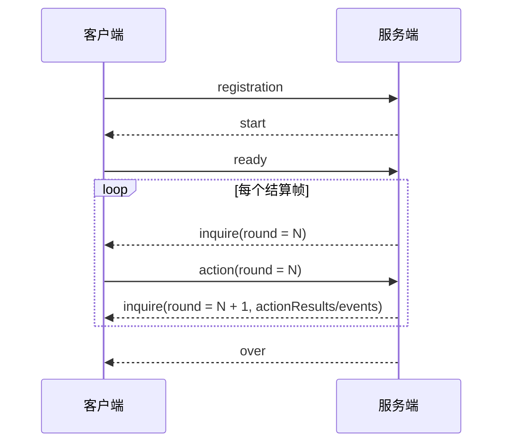

# 《一骑红尘：荔枝争运战》通信协议

| 协议                               | 日期       | 作者   |
| ---------------------------------- | ---------- | ------ |
| 《一骑红尘：荔枝争运战》通信协议V1 | 2026-06-22 | 王明海 |
| 《一骑红尘：荔枝争运战》通信协议V2 | 2026-06-27 | 刘磊   |
| 《一骑红尘：荔枝争运战》通信协议V3 | 2026-06-29 | 刘磊   |

---

# 1. 通信方式

### 正式比赛采用

```text
采用C/S方式交互，对战过程包含1个服务端和多个客户端，服务端由主办方提供，客户端由参战队伍提供。
客户端与服务端之间，通过TCP Socket通讯。
客户端Socket通信一次收包可能收不全（需处理粘包、分包问题），参赛队伍请务必考虑此场景，避免因收包未收全直接处理消息而导致掉线。
```

### TCP 拆包/粘包处理要求

TCP 是字节流。客户端和服务端都按 5 位长度前缀拆帧。

消息格式：

```text
5 位十进制长度前缀 + UTF-8 JSON body
示例：00123{"msg_name":"inquire","msg_data":{...}}
```

接收方必须做到：

| 场景 | 要求 |
| --- | --- |
| 半包 | 先缓存字节，等完整 body 收齐再解析 |
| 粘包 | 按 5 位长度前缀循环拆出多条消息 |
| 中文跨包 | 先按字节缓存，完整后再 UTF-8 解码 |
| 大消息 | `start`、`inquire`、`over` 都可能被拆包 |

服务端已按字节流处理客户端上行消息。客户端也必须按相同规则处理服务端下发消息。

推荐做法：

```text
ByteBuf -> 按长度前缀拆帧 -> UTF-8 解码 -> JSON 解析
```

不要这样做：

```text
StringDecoder -> 直接 JSON.parseObject(channelRead 收到的字符串)
```

长度规则：

| 规则 | 说明 |
| --- | --- |
| 长度前缀 | 固定 5 个 ASCII 数字 |
| 长度含义 | JSON body 的 UTF-8 字节数 |
| 最大长度 | 99999 字节 |
| 中文内容 | 可能是原始 UTF-8，也可能是 `\uXXXX` 转义 |
| 消息边界 | 只能按长度前缀判断，不能按换行、缓冲区大小或 read 次数判断 |

# 2. 默认地图与人物编号

### 初赛地图总览

| 字段 | 类型 | 值 | 中文含义 |
| --------------- | --- | ---------------------------- | ---------------- |
| `mapId` | String | `litchi_map_full_coverage` | 初赛地图 ID |
| `mapName` | String | 一骑红尘：荔枝争运战竞技地图 | 初赛地图名称 |
| `designVersion` | String | `V4.18` | 地图设计版本 |
| `grid.width` | String | `80` | 地图网格宽度 |
| `grid.height` | String | `60` | 地图网格高度 |
| `grid.origin` | String | `TOP_LEFT` | 坐标原点在左上角 |
| `xAxis` | String | `RIGHT` | X 轴向右递增 |
| `yAxis` | String | `DOWN` | Y 轴向下递增 |

### 地形元素编号

| 单位名称 | 编号 | 服务端标识 | 描述                                       | 控制归属 |
| -------- | ---- | ---------- | ------------------------------------------ | -------- |
| 空白网格 | `0`  | `EMPTY`    | 地图背景或空白区域，主车队不按网格自由寻路 | 无       |
| 官道网格 | `1`  | `ROAD`     | 官道路段的地图渲染网格                     | 初赛地图 |
| 水路网格 | `2`  | `WATER`    | 水路路段的地图渲染网格                     | 初赛地图 |
| 山路网格 | `3`  | `MOUNTAIN` | 山路路段的地图渲染网格                     | 初赛地图 |
| 支路网格 | `4`  | `BRANCH`   | 支路或连接线的地图渲染网格                 | 初赛地图 |

说明：主车队真实移动不直接读取网格 `0/1/2/3/4` 寻路，而是按 `nodes[]` 和 `edges[]` 组成的路线图移动。网格编号主要给地图展示、回放渲染、天气区域显示使用。

### 站点元素编号

| 单位名称 | 编号  | 服务端标识                   | 描述                                                         | 控制归属 |
| -------- | ----- | ---------------------------- | ------------------------------------------------------------ | -------- |
| 岭南果园 | `101` | `S01_LINGNAN_ORCHARD`        | 起点，站点 ID `S01`，坐标 `(5,50)`，类型 `START`             | 初赛地图 |
| 南岭驿   | `102` | `S02_NANLING_STATION`        | 驿站/检查点，站点 ID `S02`，坐标 `(15,44)`，类型 `CHECKPOINT` | 初赛地图 |
| 梅关驿   | `103` | `S03_MEIGUAN_STATION`        | 关隘驿站，站点 ID `S03`，坐标 `(22,38)`，类型 `PASS`         | 初赛地图 |
| 江南码头 | `104` | `S04_JIANGNAN_DOCK`          | 码头节点，站点 ID `S04`，坐标 `(22,52)`，类型 `DOCK`         | 初赛地图 |
| 洞庭水驿 | `105` | `S05_DONGTING_WATER_STATION` | 水路驿站，站点 ID `S05`，坐标 `(38,48)`，类型 `WATER_STATION` | 初赛地图 |
| 五岭山道 | `106` | `S06_WULING_MOUNTAIN_ROAD`   | 山路节点，站点 ID `S06`，坐标 `(14,32)`，类型 `MOUNTAIN_NODE` | 初赛地图 |
| 荆襄大驿 | `107` | `S07_JINGXIANG_STATION`      | 中段驿站，站点 ID `S07`，坐标 `(40,36)`，类型 `STATION`      | 初赛地图 |
| 秦岭栈道 | `108` | `S08_QINLING_PLANK_ROAD`     | 山路关口，站点 ID `S08`，坐标 `(42,24)`，类型 `MOUNTAIN_PASS` | 初赛地图 |
| 洛阳驿   | `109` | `S09_LUOYANG_STATION`        | 中后段驿站，站点 ID `S09`，坐标 `(55,32)`，类型 `STATION`    | 初赛地图 |
| 武关     | `110` | `S10_WU_PASS`                | 关键关隘，站点 ID `S10`，坐标 `(62,26)`，类型 `KEY_PASS`     | 初赛地图 |
| 潼关驿   | `111` | `S11_TONG_PASS_STATION`      | 关隘驿站，站点 ID `S11`，坐标 `(66,22)`，类型 `PASS`         | 初赛地图 |
| 关中平原 | `112` | `S12_GUANZHONG_PLAIN`        | 汇合节点，站点 ID `S12`，坐标 `(70,20)`，类型 `JUNCTION`     | 初赛地图 |
| 灞桥驿   | `113` | `S13_BAQIAO_STATION`         | 宫门前驿站，站点 ID `S13`，坐标 `(73,19)`，类型 `PALACE_STATION` | 初赛地图 |
| 朱雀门   | `114` | `S14_ZHUQUE_GATE`            | 宫门验核点，站点 ID `S14`，坐标 `(76,18)`，类型 `GATE`       | 初赛地图 |
| 兴庆宫   | `115` | `S15_XINGQING_PALACE`        | 终点交付点，站点 ID `S15`，坐标 `(78,18)`，类型 `FINISH`     | 初赛地图 |

### 路线编号

地图路线以 `edgeId` 为编号。`distance` 是服务端移动成本基础值，路线是否真正可走以 `start.edges[]` 实际下发为准。

| 路线编号 | 起点           | 终点           | 路线类型   | 距离 | 说明           |
| -------- | -------------- | -------------- | ---------- | ---- | -------------- |
| `E01`    | `S01` 岭南果园 | `S02` 南岭驿   | `ROAD`     | `30` | 官道起步段     |
| `E02`    | `S02` 南岭驿   | `S03` 梅关驿   | `ROAD`     | `25` | 官道前段       |
| `E03`    | `S03` 梅关驿   | `S07` 荆襄大驿 | `ROAD`     | `54` | 官道中段       |
| `E04`    | `S07` 荆襄大驿 | `S09` 洛阳驿   | `ROAD`     | `46` | 官道中后段     |
| `E05`    | `S09` 洛阳驿   | `S10` 武关     | `ROAD`     | `40` | 官道入关段     |
| `E06`    | `S10` 武关     | `S11` 潼关驿   | `ROAD`     | `36` | 关键关隘后段   |
| `E07`    | `S11` 潼关驿   | `S12` 关中平原 | `ROAD`     | `20` | 关中连接段     |
| `E08`    | `S12` 关中平原 | `S13` 灞桥驿   | `ROAD`     | `25` | 宫门前连接段   |
| `E09`    | `S13` 灞桥驿   | `S14` 朱雀门   | `ROAD`     | `18` | 宫门前段       |
| `E10`    | `S14` 朱雀门   | `S15` 兴庆宫   | `ROAD`     | `10` | 验核后终点段   |
| `E11`    | `S02` 南岭驿   | `S04` 江南码头 | `ROAD`     | `20` | 官道到码头连接 |
| `E12`    | `S04` 江南码头 | `S05` 洞庭水驿 | `WATER`    | `44` | 水路主段       |
| `E13`    | `S05` 洞庭水驿 | `S07` 荆襄大驿 | `BRANCH`   | `46` | 水路回官道支线 |
| `E15`    | `S01` 岭南果园 | `S06` 五岭山道 | `MOUNTAIN` | `44` | 山路起步段     |
| `E16`    | `S06` 五岭山道 | `S08` 秦岭栈道 | `MOUNTAIN` | `54` | 山路主段       |
| `E17`    | `S08` 秦岭栈道 | `S10` 武关     | `BRANCH`   | `46` | 山路入关支线   |
| `E18`    | `S03` 梅关驿   | `S06` 五岭山道 | `BRANCH`   | `38` | 官道转山路支线 |
| `E19`    | `S05` 洞庭水驿 | `S09` 洛阳驿   | `WATER`    | `48` | 水路直达洛阳   |
| `E20`    | `S07` 荆襄大驿 | `S08` 秦岭栈道 | `MOUNTAIN` | `42` | 官道转山路连接 |
| `E21`    | `S04` 江南码头 | `S07` 荆襄大驿 | `BRANCH`   | `54` | 码头回官道支线 |
| `E22`    | `S08` 秦岭栈道 | `S09` 洛阳驿   | `BRANCH`   | `64` | 山路回洛阳支线 |

### 流程节点编号

| 站点           | 流程类型          | 处理回合 | 是否可窗口争夺 | 中文含义       |
| -------------- | ----------------- | -------- | -------------- | -------------- |
| `S02` 南岭驿   | `TRANSFER`        | `4`      | `true`         | 换乘/流程处理  |
| `S04` 江南码头 | `BOARD`           | `7`      | `true`         | 登船处理       |
| `S05` 洞庭水驿 | `WATER_TRANSFER`  | `6`      | `true`         | 水路换乘       |
| `S11` 潼关驿   | `PASS_TRANSFER`   | `5`      | `true`         | 关隘通行处理   |
| `S13` 灞桥驿   | `PALACE_TRANSFER` | `5`      | `true`         | 宫门前流程处理 |
| `S14` 朱雀门   | `VERIFY`          | `6`      | `true`         | 宫门验核       |

### 资源投放表

| 站点           | 资源类型          | 中文含义  | 数量 | 领取回合 |
| -------------- | ----------------- | --------- | ---- | -------- |
| `S03` 梅关驿   | `ICE_BOX`         | 冰鉴      | `1`  | `2`      |
| `S03` 梅关驿   | `PASS_TOKEN`      | 通行令    | `1`  | `2`      |
| `S03` 梅关驿   | `INTEL`           | 情报      | `1`  | `2`      |
| `S04` 江南码头 | `SHORT_HORSE`     | 短途马    | `1`  | `2`      |
| `S04` 江南码头 | `BOAT_RIGHT`      | 船权      | `1`  | `2`      |
| `S04` 江南码头 | `INTEL`           | 情报      | `1`  | `2`      |
| `S06` 五岭山道 | `ICE_BOX`         | 冰鉴      | `1`  | `2`      |
| `S06` 五岭山道 | `INTEL`           | 情报      | `1`  | `2`      |
| `S08` 秦岭栈道 | `SHORT_HORSE`     | 短途马    | `1`  | `2`      |
| `S08` 秦岭栈道 | `PASS_TOKEN`      | 通行令    | `1`  | `2`      |
| `S08` 秦岭栈道 | `INTEL`           | 情报      | `1`  | `2`      |
| `S07` 荆襄大驿 | `ICE_BOX`         | 冰鉴      | `1`  | `2`      |
| `S07` 荆襄大驿 | `SHORT_HORSE`     | 短途马    | `1`  | `2`      |
| `S11` 潼关驿   | `INTEL`           | 情报      | `1`  | `2`      |
| `S09` 洛阳驿   | `FAST_HORSE`      | 快马      | `1`  | `2`      |
| `S09` 洛阳驿   | `OFFICIAL_PERMIT` | 官凭/许可 | `1`  | `2`      |
| `S10` 武关     | `INTEL`           | 情报      | `1`  | `2`      |
| `S13` 灞桥驿   | `PASS_TOKEN`      | 通行令    | `1`  | `2`      |
| `S13` 灞桥驿   | `OFFICIAL_PERMIT` | 官凭/许可 | `1`  | `2`      |
| `S13` 灞桥驿   | `INTEL`           | 情报      | `1`  | `2`      |

### 人物/阵营编号

服务端没有固定写死“某个玩家一定是红方或蓝方”。`playerId` 由客户端注册传入，红蓝阵营由服务端按启动配置和公平策略分配，最终以 `start.players[]` 实际下发为准。

| 单位名称   | 编号           | 服务端标识      | 描述                                                         | 控制归属 |
| ---------- | -------------- | --------------- | ------------------------------------------------------------ | -------- |
| 无阵营     | `-1`           | `NONE`          | 无归属或未分配阵营                                           | 无       |
| 红方主车队 | `0`            | `RED`           | 红方玩家控制的主车队，图标资源默认 `Convoy_Red`              | 玩家     |
| 蓝方主车队 | `1`            | `BLUE`          | 蓝方玩家控制的主车队，图标资源默认 `Convoy_Blue`             | 玩家     |
| 中立对象   | `2`            | `NEUTRAL`       | 中立节点、公共对象或无玩家归属对象                           | 系统     |
| 红方小分队 | 无独立固定编号 | `RED` 队伍派生  | 由红方玩家动作 `SQUAD_SCOUT`、`SQUAD_CLEAR`、`SQUAD_REINFORCE`、`SQUAD_WEAKEN` 派出 | 玩家     |
| 蓝方小分队 | 无独立固定编号 | `BLUE` 队伍派生 | 由蓝方玩家动作 `SQUAD_SCOUT`、`SQUAD_CLEAR`、`SQUAD_REINFORCE`、`SQUAD_WEAKEN` 派出 | 玩家     |

人物相关字段对应关系：

| 字段 | 类型 | 中文名 | 说明 |
| ---------------- | --- | ------------------ | --------------------------------- |
| `playerId` | Int | 玩家 ID | 客户端注册时传入 |
| `camp` | Int | 阵营数字 | `0` 红方，`1` 蓝方，`2` 中立 |
| `teamId` | String | 队伍标识 | `RED` 或 `BLUE` |
| `playerName` | String | 玩家名称 | 客户端注册名称 |
| `squadAvailable` | Int | 可用小分队数量 | 玩家当前还能派出的数量 |
| `squadInFlight` | Int | 执行中的小分队数量 | 已派出但尚未完成/返回的小分队数量 |

# 3. 通用消息格式

客户端需要重点处理 4 类服务端下发消息：

1. `start`
2. `inquire`
3. `over`
4. `error`

所有网络消息的 JSON 外层统一为：

| 字段 | 类型 | 中文名 | 说明 |
| ---------- | --- | -------- | -------------------------------------------- |
| `msg_name` | String | 消息名称 | 用来区分 `start`、`inquire`、`over`、`error` |
| `msg_data` | Object | 消息内容 | 真正的业务数据对象 |

通用 JSON 外层：

```json
00036{
  "msg_name": "inquire",
  "msg_data": {}
}
```

长度前缀规则见第 1 章，本章只说明 JSON 外层结构。

通用字段规则：

| 规则项 | 要求 |
|---|---|
| 外层字段 | 所有消息都必须使用 `msg_name` 和 `msg_data` 作为 JSON 外层字段 |
| 字段名 | 字段名大小写敏感；除 `msg_name`、`msg_data` 外，字段名按本文列出的协议字段发送 |
| 枚举值 | 枚举值大小写敏感；客户端必须发送英文枚举值，不得发送中文含义 |
| 客户端发送字段 | 除字段表明确写“可选”“可省略”或“可为 null”外，客户端发送字段均按必传处理 |
| 服务端下发字段 | 客户端必须允许服务端新增公开字段；未知字段不得导致解析失败 |
| null 与空数组 | 只有本文示例或字段表允许为 `null` 的字段才可填 `null`；没有主动动作时，`actions` 必须传空数组 `[]` |
| 未列字段 | 参赛程序不得依赖未列入本协议的字段推导规则状态 |

字段读取优先级：

| 客户端目标 | 优先读取 | 说明 |
|---|---|---|
| 确认本局身份 | `start.matchId` | `ready` 和 `action` 必须原样回传 |
| 初始化地图 | `start.nodes[]`、`start.edges[]`、`start.map.gameplay` | 不要写死节点、路线、资源和任务位置 |
| 判断当前状态 | `inquire.players[]`、`inquire.nodes[]`、`inquire.tasks[]` | 每帧运行时状态以 `inquire` 为准 |
| 判断移动进度 | `edgeProgressMs`、`edgeTotalMs`、`moveDirection` | `edgeProgressPermille` 适合展示，精确判断用毫秒字段 |
| 判断动作结果 | `inquire.events[]` | 事件是判断动作是否真正生效的第一依据 |
| 读取动作摘要 | `inquire.actionResults[]` | 只表示上一帧动作包摘要，不代替事件判断 |
| 读取当前分数 | `players[].scoreDetail`、`scorePreview` | 仅用于策略预估 |
| 判断最终胜负 | `over.resultType`、`over.winnerPlayerId`、`over.players[].totalScore` | 最终结果只以 `over` 为准 |

协议对象与枚举速查：

常用对象：

| 对象 | 说明 |
| --- | --- |
| `playerId` | 参赛队伍唯一编号 |
| `nodeId` | 本局站点编号，以 `start.nodes[]` 为准 |
| `edgeId` | 本局路线边编号，以 `start.edges[]` 为准 |
| `matchId` | 本局唯一比赛编号，后续消息必须回传 |

路线与站点：

| 枚举 | 中文含义 |
| --- | --- |
| `ROAD` / `WATER` | 官道 / 水路 |
| `MOUNTAIN` / `BRANCH` | 山路 / 支路 |
| `START` / `FINISH` | 起点 / 终点 |
| `PASS` / `KEY_PASS` | 关隘 / 关键关隘 |
| `DOCK` / `WATER_STATION` | 码头 / 水驿 |
| `GATE` / `PALACE_STATION` | 宫门 / 宫前驿 |

状态与阶段：

| 枚举 | 中文含义 |
| --- | --- |
| `NORMAL` / `RUSH` / `ENDED` | 普通 / 冲刺 / 已结束 |
| `IDLE` / `MOVING` / `WAITING` | 空闲 / 移动 / 等待 |
| `PROCESSING` / `CONTESTING` | 处理中 / 窗口争夺中 |
| `RESTING` / `VERIFYING` | 休整 / 宫门验核中 |
| `DELIVERED` / `RETIRED` | 已交付 / 已退赛 |

玩法枚举：

| 枚举 | 中文含义 |
| --- | --- |
| `ICE_BOX` / `INTEL` | 冰鉴 / 情报 |
| `FAST_HORSE` / `SHORT_HORSE` | 快马 / 短程马 |
| `BOAT_RIGHT` / `PASS_TOKEN` | 船权 / 过所 |
| `OFFICIAL_PERMIT` | 官凭 |
| `RESOURCE` / `TASK` | 资源窗口 / 任务窗口 |
| `GATE` / `DOCK` / `PASS` | 宫门 / 码头 / 通行窗口 |
| `YAN_DIE` / `QIANG_XING` | 验牒 / 强行 |
| `XIAN_GONG` / `BING_ZHENG` | 献贡 / 兵争 |
| `ABSTAIN` | 弃权 |

天气与结算：

| 枚举 | 中文含义 |
| --- | --- |
| `HOT` | 酷暑 |
| `HEAVY_RAIN` | 暴雨 |
| `MOUNTAIN_FOG` | 山雾 |
| `NORMAL` / `FORFEIT` | 正常结束 / 退赛判负 |
| `INVALID` / `DRAW` | 无效局 / 平局 |

---

# 4. 消息流程

消息流程图：



结算帧怎么提交：

```text
客户端收到 inquire.round = N 后，就提交 action.round = N。
这组 action 参与 round N 的服务端结算。
round N 的处理结果，会在下一次 inquire 的 actionResults 和 events 中下发。
```

示例：

```text
Server → Client：inquire.round = 124
Client → Server：action.round = 124
Server → Client：inquire.round = 125，其中 actionResults/events 返回 round 124 的处理结果
```

动作反馈读取顺序：

| 顺序 | 读取内容 | 客户端判断 |
| ---: | --- | --- |
| 1 | `error` | 当前包未进入规则结算，先修正发包 |
| 2 | `inquire.events[]` | 判断动作是否真正生效、被拒绝或触发窗口 |
| 3 | `inquire.actionResults[]` | 读取上一帧动作汇总结果 |
| 4 | 下一帧状态字段 | 以 `players`、`nodes`、`tasks` 等更新本地状态 |

`accepted = true` 不等于一定拿到收益；`accepted = false` 也不一定是非法动作。

业务拒绝以 `events[].type = "ACTION_REJECTED"` 和 `payload.errorCode` 为准，不计非法动作。

最小客户端收发流程：

| 步骤 | 客户端处理 | 关键点 |
|---:|---|---|
| 1 | 建立 TCP 长连接 | 按第 1 章处理 5 位长度前缀 |
| 2 | 发送 `registration` | 提交 `playerId`、`playerName`、`version` |
| 3 | 接收 `start` | 缓存 `matchId`、自身阵营、地图、资源和任务模板 |
| 4 | 发送 `ready` | `matchId` 必须等于 `start.matchId`，`round` 填 1 |
| 5 | 接收 `inquire` | 使用 `inquire.round` 决策本帧动作 |
| 6 | 发送 `action` | 即使没有主动动作，也发送 `actions: []` |
| 7 | 循环处理 `inquire` | 先看 `events[]`，再看 `actionResults[]` 和状态字段 |
| 8 | 接收 `over` | 读取最终胜负和分项得分 |

直连完整流程精简 JSON 示例：

下面示例演示一名客户端从连接服务端到提交移动动作的最小流程。每个代码块用 JSON 格式展示完整发送样例：最前面的 5 位数字是真实发送时放在消息体前面的十进制长度前缀，后面的 `jsonBody` 是实际消息体。长度按 `jsonBody` 压缩为 UTF-8 后的字节数计算，发送时不需要额外换行。

`start` 和 `inquire` 是服务端下发消息。真实比赛中这两类消息会包含完整地图、资源、任务、玩家状态、窗口和事件等更多字段；这里为了说明接入流程，只保留最核心字段。客户端实际开发时，必须以服务端真实下发内容为准，完整字段见第 6 章 `start.msg_data` 和第 8 章 `inquire.msg_data`。

1. Client -> Server：注册队伍

```json
00096{
  "msg_name": "registration",
  "msg_data": {
    "playerId": 1001,
    "playerName": "demo-red",
    "version": "1.0"
  }
}
```

2. Server -> Client：下发 start，客户端保存 matchId、阵营、地图和起终点

此处为精简示例，完整下发字段见第 6 章 `start.msg_data`、`start.players[]`、`start.nodes[]`、`start.edges[]`、`start.resources[]` 和 `start.taskTemplates[]`。

```json
00326{
  "msg_name": "start",
  "msg_data": {
    "matchId": "match_20260627_001",
    "round": 1,
    "playerId": 1001,
    "teamId": "RED",
    "camp": 0,
    "startNodeId": "S01",
    "finishNodeId": "S15",
    "nodes": [
      {
        "nodeId": "S01",
        "type": "START"
      },
      {
        "nodeId": "S02",
        "type": "NORMAL"
      }
    ],
    "edges": [
      {
        "edgeId": "E01",
        "fromNodeId": "S01",
        "toNodeId": "S02",
        "routeType": "ROAD",
        "distance": 25
      }
    ]
  }
}
```

3. Client -> Server：发送 ready，matchId 必须使用 start 下发值

```json
00090{
  "msg_name": "ready",
  "msg_data": {
    "matchId": "match_20260627_001",
    "round": 1,
    "playerId": 1001
  }
}
```

4. Server -> Client：下发第 1 帧 inquire，客户端用 inquire.round 决策动作

此处为精简示例，完整下发字段见第 8 章 `inquire.msg_data`，以及第 9 章 `players`、第 10 章 `nodes`、第 11 章 `weather`、第 14 章 `actionResults`。

```json
00205{
  "msg_name": "inquire",
  "msg_data": {
    "matchId": "match_20260627_001",
    "round": 1,
    "playerId": 1001,
    "players": [
      {
        "playerId": 1001,
        "teamId": "RED",
        "state": "IDLE",
        "currentNodeId": "S01"
      }
    ],
    "events": [],
    "actionResults": []
  }
}
```

5. Client -> Server：没有动作时也发空动作心跳

```json
00104{
  "msg_name": "action",
  "msg_data": {
    "matchId": "match_20260627_001",
    "round": 1,
    "playerId": 1001,
    "actions": []
  }
}
```

6. Client -> Server：有动作时提交 MOVE；targetNodeId 必须是当前节点相邻可达节点

```json
00142{
  "msg_name": "action",
  "msg_data": {
    "matchId": "match_20260627_001",
    "round": 2,
    "playerId": 1001,
    "actions": [
      {
        "action": "MOVE",
        "targetNodeId": "S02"
      }
    ]
  }
}
```

直连时最容易填错的字段：

| 字段 | 类型 | 中文名 | 说明 |
| --- | --- | --- | --- |
| `matchId` | String | 对局编号 | 必须原样使用 `start.msg_data.matchId` |
| `playerId` | Int | 玩家编号 | 必须和 `registration` 中提交的一致 |
| `round` | Int | 回合编号 | `ready.round` 通常填 `start.round`；`action.round` 填当前收到的 `inquire.round` |
| `targetNodeId` | String | 目标节点编号 | 必须来自地图或 `inquire` 中可达的相邻节点 |
| 长度前缀 | String | 消息长度前缀 | 必须按 JSON body 的 UTF-8 字节数计算，固定 5 位十进制，不含前缀本身 |

---

# 5. registration

触发时机：客户端应在连接服务端成功后发此消息

作用：registration 消息用于客户端向服务端注册自己的队伍Id和队名

示例：

```json
00100{
  "msg_name": "registration",
  "msg_data": {
    "playerId": 1111,
    "playerName": "岭南贡队",
    "version": "1.0"
  }
}
```

registration 字段说明：

| 字段 | 类型 | 中文名 | 说明 |
| --- | --- | --- | --- |
| playerId | Int | 玩家编号 | 参赛队伍唯一编号；后续 `ready` 和 `action` 必须使用同一个值 |
| playerName | String | 队伍名称 | 报名时提交的参赛队伍名称；用于识别队伍，不参与规则结算 |
| version | String | 客户端版本 | 参赛程序版本号，用于连接诊断 |

registration 连接规则：

```text
当前服务端固定一局两名真实客户端对战，只在比赛 IDLE（空闲） 阶段接受 registration。
两名客户端完成 registration 后，服务端生成 start 并进入比赛流程。
比赛开始后再次发送 registration 不会重新绑定队伍；当前实时协议不承诺比赛中断线重连。
连接断开后，服务端会把该队伍标记为离线，并按失联动作、退赛和 over 规则继续结算。
playerName 和 version 为必传字符串；服务端会分别截断到 16 和 8 个字符。缺失或为 null 时，当前服务端可能返回 ACTION_REJECTED，而不是 MISSING_REQUIRED_FIELD。
```

---

# 6. start

触发时机：双方客户端完成 `registration` 后，服务端向双方下发。

作用：告诉客户端本局对局编号、双方阵营、地图、路线、资源初始配置、任务模板等静态信息。

客户端关注：`start` 必须解析并缓存。后续 `ready` 和 `action` 都要原样回传 `matchId`；寻路、资源和任务策略都应基于本局下发的地图，不要写死节点路线。

示例：

```json
02017{
  "msg_name": "start",
  "msg_data": {
    "matchId": "match_001",
    "rulesVersion": "4.1",
    "seedHash": "sha256:4f8d0c2a7b6e9f1d0a3c5e8b9d2f6a1c",
    "round": 1,
    "tick": 0,
    "durationRound": 600,
    "map": {
      "schemaVersion": "2.0",
      "mapId": "litchi_map_medium_a",
      "mapName": "荔枝争运中图 A",
      "designVersion": "4.1",
      "mapConfigFile": "map_config_medium_a.json",
      "maxX": 80,
      "maxY": 60,
      "layers": {
        "terrainData": "",
        "objectData": "",
        "weatherData": ""
      },
      "nodes": [],
      "edges": [],
      "routePaths": [],
      "weatherRegionRule": {
        "HOT": {
          "weatherRegionCode": 1,
          "renderMode": "FULLSCREEN_OVERLAY"
        },
        "HEAVY_RAIN": {
          "weatherRegionCode": 2,
          "renderMode": "REGION_OVERLAY"
        },
        "MOUNTAIN_FOG": {
          "weatherRegionCode": 3,
          "renderMode": "REGION_OVERLAY"
        }
      },
      "gameplay": {
        "roles": {
          "startNodeId": "S01",
          "terminalNodeIds": [
            "S15"
          ],
          "gateNodeId": "S14",
          "safeZoneNodeIds": [
            "S15"
          ],
          "reverifyNodeId": "S14",
          "rushExcludedNodeIds": [
            "S11",
            "S12",
            "S13"
          ]
        },
        "resources": [],
        "processNodes": [],
        "taskCandidates": {},
        "routeTaskBuckets": {},
        "obstacleCandidateNodeIds": []
      }
    },
    "players": [
      {
        "playerId": 1111,
        "camp": 0,
        "teamId": "RED",
        "name": "岭南贡队"
      },
      {
        "playerId": 2222,
        "camp": 1,
        "teamId": "BLUE",
        "name": "长安疾运队"
      }
    ],
    "nodes": [
      {
        "nodeId": "S03",
        "code": 103,
        "name": "梅关驿",
        "x": 18,
        "y": 22,
        "type": "PASS",
        "icon": "node_pass",
        "nodeType": "PASS",
        "start": false,
        "terminal": false
      },
      {
        "nodeId": "S07",
        "code": 107,
        "name": "荆襄大驿",
        "x": 42,
        "y": 28,
        "type": "STATION",
        "icon": "node_station",
        "nodeType": "STATION",
        "start": false,
        "terminal": false
      }
    ],
    "edges": [
      {
        "edgeId": "E03",
        "fromNode": "S03",
        "fromNodeId": "S03",
        "toNode": "S07",
        "toNodeId": "S07",
        "routeType": "ROAD",
        "distance": 46,
        "bidirectional": true,
        "pathId": "P03"
      }
    ],
    "routePaths": [
      {
        "pathId": "P03",
        "edgeId": "E03",
        "points": [
          {
            "x": 18,
            "y": 22
          },
          {
            "x": 42,
            "y": 28
          }
        ]
      }
    ],
    "resources": [
      {
        "nodeId": "S03",
        "resourceType": "ICE_BOX",
        "count": 1,
        "claimRound": 2
      },
      {
        "nodeId": "S07",
        "resourceType": "SHORT_HORSE",
        "count": 1,
        "claimRound": 2
      }
    ],
    "taskTemplates": [
      {
        "taskTemplateId": "T04",
        "name": "清障任务",
        "candidateNodeIds": [
          "S06",
          "S08"
        ],
        "processType": "CLEAR_OBSTACLE",
        "processRound": 6,
        "requiredFreshness": 0.0,
        "requiredResourceTypes": [],
        "score": 30
      }
    ]
  }
}
```

正式 `start` 下发本局静态公开配置。客户端不要写死某张地图的节点编号。

客户端读取建议：

| 想做什么 | 优先读取 |
| --- | --- |
| 判断能否移动、移动耗时 | `start.edges[]`，运行时优先用 `inquire.edges[]` |
| 识别起点、终点、宫门、安全区 | `start.map.gameplay.roles` |
| 识别节点角色 | `start.nodes[].start`、`start.nodes[].terminal`、`nodeType/type` |
| 初始化资源和任务模型 | `start.map.gameplay.resources`、`taskCandidates`、`routeTaskBuckets` |
| 地图绘制 | `start.routePaths`、`start.map.layers` |
| 判断天气实际影响 | `inquire.weather.active`、`inquire.weather.forecast` |

运行时状态以每帧 `inquire` 为准：

| 动态内容 | 读取字段 |
| --- | --- |
| 资源库存 | `inquire.nodes[]` |
| 障碍、设卡、处理点状态 | `inquire.nodes[]` |
| 任务实例 | `inquire.tasks[]` |
| 窗口争夺 | `inquire.contests[]` |
| 动作结果 | `inquire.actionResults[]`、`inquire.events[]` |

### start.msg_data 字段

| 字段 | 类型 | 中文名 | 说明 |
| --- | --- | --- | --- |
| matchId | String | 对局编号 | 本局唯一标识；客户端后续 `ready` 和 `action` 必须原样回传 |
| rulesVersion | String | 规则版本 | 协议和规则配置版本 |
| seedHash | String | 随机种子摘要 | 用于赛后校验；实时协议不下发完整 `seed` |
| round | Int | 起始结算帧 | 通常为 1；客户端 `ready.round` 使用该值 |
| tick | Int | 帧序号 | 当前 start 固定为 0；规则判断使用 `round` |
| durationRound | Int | 最大持续回合数 | 当前为 600 |
| map | Object | 地图配置回显 | 当前服务端下发的完整地图配置对象，包含展示层与 gameplay 配置 |
| players | Array<Object> | 开局玩家列表 | 包含 playerId、红蓝方和队伍名称 |
| nodes | Array<Object> | 静态站点列表 | 本局地图站点，客户端不要硬编码站点 |
| edges | Array<Object> | 静态路线边列表 | 判断能否移动、路线类型、移动距离 |
| routePaths | Array<Object> | 路线渲染折线 | 当前服务端下发的前端/回放绘制数据；规则结算不直接使用 |
| resources | Array<Object> | 静态资源初始配置 | 本局资源投放点、类型、数量、领取时间 |
| taskTemplates | Array<Object> | 皇榜任务模板 | 任务模板名称、候选节点、处理类型、处理帧数、需求条件和基础分以本局 `start.taskTemplates[]` 为准；运行时活跃任务以 `inquire.tasks[]` 为准 |

### start.players[] 字段

| 字段 | 类型 | 中文名 | 说明 |
| --- | --- | --- | --- |
| playerId | Int | 玩家ID | 唯一标识客户端队伍 |
| camp | Int | 阵营数字 | 服务端内部阵营编号 |
| teamId | String | 红蓝方 | `RED` / `BLUE` 枚举，只表示阵营方位，不是玩家编号； |
| name | String | 玩家名称 | 参赛队伍名称； |

---

### start.map 字段

| 字段 | 类型 | 中文名 | 说明 |
| ------------------- | --- | ---------------- | -------------------------------------------------- |
| `schemaVersion` | String | 地图结构版本 | 地图配置格式版本 |
| `mapId` | String | 地图 ID | 当前地图唯一标识 |
| `mapName` | String | 地图名称 | 当前地图展示名称 |
| `designVersion` | String | 地图设计版本 | 地图设计迭代版本 |
| `mapConfigFile` | String | 地图配置文件名 | 服务端加载的地图配置来源 |
| `data` | String | 地图载荷 | 地图网格或展示数据；策略通常读取 `nodes`、`edges`、`gameplay` |
| `maxX` | Int | 地图 X 轴宽度 | 前端渲染坐标范围 |
| `maxY` | Int | 地图 Y 轴高度 | 前端渲染坐标范围 |
| `layers` | Object | 地图分层数据 | 给前端或回放渲染使用 |
| `nodes` | Array<Object> | 地图站点列表 | 与顶层 `start.nodes` 描述同一批站点 |
| `edges` | Array<Object> | 地图路线边列表 | 与顶层 `start.edges` 描述同一批路线 |
| `routePaths` | Array<Object> | 路线渲染折线 | 用于画线路径，不用于服务端寻路 |
| `weatherRegionRule` | Map<String, Object> | 天气区域渲染规则 | 天气类型到地图区域编码、渲染方式的映射 |
| `gameplay` | Object | 地图玩法绑定 | 地图上的起点、终点、宫门、资源点、任务点等玩法语义 |

### start.map.weatherRegionRule 字段

| 字段 | 类型 | 中文名 | 说明 |
| ------------------- | --- | ------------ | -------------------------- |
| `weatherRegionCode` | Int | 天气区域编码 | 前端可据此标记天气影响范围 |
| `renderMode` | String | 渲染方式 | 例如全屏覆盖、区域覆盖 |

补充说明：`weatherRegionRule` 是动态映射，外层 key 是天气类型，例如 `RAIN`、`HEAT`、`WIND` 等；value 才是上表中的对象。

### start.map.layers 字段

`layers` 是地图网格分层数据，主要用于前端、回放或调试渲染；策略客户端通常只需要用 `nodes`、`edges`、`gameplay` 做寻路和决策。

| 字段 | 类型 | 中文名 | 说明 |
| ------------- | --- | ---------------- | ------------------------------------------------------------ |
| `terrainData` | String | 地形网格 CSV | 地图地形层，服务端从地图配置的 `terrainData.data` 提取 |
| `objectData` | String | 对象网格 CSV | 地图对象层，可用于渲染站点、标识、障碍等视觉信息 |
| `weatherData` | String | 天气区域网格 CSV | 服务端对外统一叫 `weatherData`，来源于地图配置里的 `weatherRegionData.data` |

### start.map.gameplay 字段

| 字段 | 类型 | 中文名 | 说明 |
| -------------------------- | --- | ------------ | ------------------------------------------------------------ |
| `roles` | Object | 地图角色点位 | 起点、终点、宫门、安全区等 |
| `resources` | Array<Object> | 资源库存点位 | 地图覆盖的资源投放配置 |
| `processNodes` | Array<Object> | 可处理站点 | 地图覆盖的读条处理点配置 |
| `taskCandidates` | Map<String, Array<String>> | 任务候选点 | key 为任务模板 ID，value 为候选站点 ID 列表 |
| `routeTaskBuckets` | Map<String, Array<String>> | 路线任务桶 | key 为 `ROAD/WATER/MOUNTAIN/BRANCH`，value 为该路线可刷任务点 |
| `obstacleCandidateNodeIds` | Array<String> | 障碍候选点 | 可生成障碍的站点 ID 列表 |

### start.map.gameplay.resources[] 字段

| 字段 | 类型 | 中文名 | 说明 |
| -------------- | --- | --------------- | ------------------------------------ |
| `nodeId` | String | 资源所在站点 ID | 该资源投放在哪个站点 |
| `resourceType` | String | 资源类型 | 例如冰鉴、马匹、船权、情报、通行令等 |
| `count` | Int | 初始数量 | 该资源初始库存 |
| `claimRound` | Int | 领取回合数 | 领取该资源需要处理多少回合 |

### start.map.gameplay.processNodes[] 字段

| 字段 | 类型 | 中文名 | 说明 |
| -------------- | --- | ---------------- | ------------------------------------- |
| `nodeId` | String | 流程站点 ID | 哪个站点有额外流程处理 |
| `processType` | String | 流程类型 | 例如换乘、登船、宫门验核等 |
| `processRound` | Int | 处理回合数 | 完成该流程需要等待多少回合 |
| `canWindow` | Boolean | 是否允许窗口争夺 | `true` 表示该流程节点可能进入窗口争夺 |

### start.map.gameplay.taskCandidates 字段

| 字段 | 类型 | 中文名 | 说明 |
| -------- | --- | ---------------- | ------------------------ |
| 动态 key | String | 任务模板 ID | 例如 `T01`、`T08` |
| value | Array<String> | 候选站点 ID 列表 | 该任务可能刷新在哪些站点 |

### start.map.gameplay.routeTaskBuckets 字段

| 字段 | 类型 | 中文名 | 说明 |
| -------- | --- | ---------------- | ------------------------------------------ |
| 动态 key | String | 路线类型 | 例如 `ROAD`、`WATER`、`MOUNTAIN`、`BRANCH` |
| value | Array<String> | 路线任务站点列表 | 该路线可参与任务分布和路线收益统计的站点 |

### start.map.gameplay.obstacleCandidateNodeIds[] 字段

| 字段 | 类型 | 中文名 | 说明 |
| ------ | --- | --------------- | ---------------------------------------- |
| 数组项 | Array<String> | 障碍候选站点 ID | 服务端可在这些站点生成或处理障碍相关玩法 |

### start.map.gameplay.roles 字段

| 字段 | 类型 | 中文名 | 说明 |
| --------------------- | --- | ---------------------- | ---------------------------------- |
| `startNodeId` | String | 起点站点 ID | 主车队初始站点 |
| `terminalNodeIds` | Array<String> | 终点站点 ID 列表 | 可交付终点 |
| `gateNodeId` | String | 宫门站点 ID | 需要验核的宫门 |
| `safeZoneNodeIds` | Array<String> | 安全区站点 ID 列表 | 安全区内部分动作会受限制 |
| `reverifyNodeId` | String | 重新验核站点 ID | 安全区重验核相关站点 |
| `rushExcludedNodeIds` | Array<String> | 宫宴冲刺提前触发排除点 | 判断冲刺阶段剩余距离时可排除的点位 |

start.map.gameplay 简例：

```json
{
  "roles": {
    "startNodeId": "S01",
    "gateNodeId": "S14",
    "terminalNodeIds": ["S15"],
    "safeZoneNodeIds": ["S15"]
  },
  "resources": [
    {
      "nodeId": "S07",
      "resourceType": "SHORT_HORSE",
      "count": 1,
      "claimRound": 2
    }
  ],
  "taskCandidates": {
    "T01": ["S06", "S08"]
  },
  "routeTaskBuckets": {
    "ROAD": ["S06", "S10"],
    "WATER": ["S04", "S09"]
  }
}
```

### start.nodes[] 字段

| 字段 | 类型 | 中文名 | 说明 |
| ---------- | --- | ------------ | --------------------------------------- |
| `nodeId` | String | 站点 ID | 例如 `S01`、`S14` |
| `code` | String | 地图节点编码 | 地图配置里的数字编码 |
| `name` | String | 站点名称 | 展示用 |
| `x` | Int | 横坐标 | 地图渲染用 |
| `y` | Int | 纵坐标 | 地图渲染用 |
| `type` | String | 站点类型 | 与 `nodeType` 互相同步 |
| `icon` | String | 地图图标标识 | 前端展示用 |
| `nodeType` | String | 站点类型 | 如 `START`、`DOCK`、`GATE`、`FINISH` 等 |
| `start` | Boolean | 是否起点 | `true` 表示起点 |
| `terminal` | Boolean | 是否终点 | `true` 表示可交付终点 |

### start.edges[] 字段

| 字段 | 类型 | 中文名 | 说明 |
| --------------- | --- | --------------- | ---------------------------------------- |
| `edgeId` | String | 路线边 ID | 路线唯一标识 |
| `fromNode` | String | 起点站点 ID | 路线起点 |
| `toNode` | String | 终点站点 ID | 路线终点 |
| `fromNodeId` | String | 起点站点别名 ID | 与 `fromNode` 同步 |
| `toNodeId` | String | 终点站点别名 ID | 与 `toNode` 同步 |
| `routeType` | String | 路线类型 | 如 `ROAD`、`WATER`、`MOUNTAIN`、`BRANCH` |
| `distance` | Int | 逻辑距离 | 服务端移动耗时计算基础 |
| `bidirectional` | Boolean | 是否双向通行 | `true` 表示双向可走 |
| `pathId` | String | 路径 ID | 用于归类路线或渲染路径 |

### start.routePaths[] / start.map.routePaths[] 字段

`routePaths` 是路线折线渲染数据。服务端逻辑移动仍以 `edges[]` 的 `fromNode`、`toNode`、`distance`、`routeType` 为准；`routePaths` 主要给浏览器回放或地图展示画出更接近真实形状的线路。

| 字段 | 类型 | 中文名 | 说明 |
| ------------ | --- | ------------- | ---------------------------------------- |
| `pathId` | String | 路径折线 ID | 一条渲染折线的唯一标识，通常类似 `P_E01` |
| `edgeId` | String | 对应路线边 ID | 该折线对应哪条 `edges[]` 路线 |
| `points` | Array<Object> | 折线点列表 | 按顺序连接这些坐标点即可画出路线 |
| `points[].x` | Int | 折线点 X 坐标 | 地图渲染坐标，不是寻路计算节点 |
| `points[].y` | Int | 折线点 Y 坐标 | 地图渲染坐标，不是寻路计算节点 |

### start.resources[] 字段

| 字段 | 类型 | 中文名 | 说明 |
| -------------- | --- | --------------- | -------------------------- |
| `nodeId` | String | 资源所在站点 ID | 资源投放在哪个站点 |
| `resourceType` | String | 资源类型 | 如马匹、冰鉴、船权等 |
| `count` | Int | 初始数量 | 该资源初始库存 |
| `claimRound` | Int | 领取读条回合数 | 领取该资源需要处理多少回合 |

### start.taskTemplates[] 字段

| 字段 | 类型 | 中文名 | 说明 |
| ----------------------- | --- | ---------------- | ------------------------ |
| `taskTemplateId` | String | 任务模板 ID | 任务模板唯一标识 |
| `name` | String | 任务名称 | 展示用 |
| `candidateNodeIds` | Array<String> | 候选站点 ID 列表 | 该任务可能刷在哪些站点 |
| `processType` | String | 任务处理类型 | 完成任务时对应的处理类型 |
| `processRound` | Int | 处理回合数 | 完成任务读条需要多少回合 |
| `requiredFreshness` | Number | 要求鲜度 | 鲜度低于该值可能无法完成 |
| `requiredResourceTypes` | Array<String> | 要求资源类型列表 | 完成任务需要持有的资源 |
| `score` | Int | 任务分值 | 完成后获得的任务分 |

# 7. ready

触发时机：用于客户端在收到start消息处理完成后触发

作用：回复准备完成消息给服务端

示例：

```json
00081{
  "msg_name": "ready",
  "msg_data": {
    "matchId": "match_001",
    "round": 1,
    "playerId": 1111
  }
}
```

ready 必传字段：

| 字段 | 类型 | 中文名 | 说明 |
| --- | --- | --- | --- |
| msg_name | String | 消息名称 | 固定为 `ready` |
| msg_data.matchId | String | 对局编号 | 必须与本局 `start.matchId` 一致 |
| msg_data.round | Int | 确认帧 | 必须填写 `start.round`，通常为 1 |
| msg_data.playerId | Int | 玩家编号 | 当前客户端绑定的参赛队伍编号 |

---

# 8. inquire

触发时机：

- 客户端发送 `ready` 成功后，服务端下发第 1 回合 `inquire`。
- 每回合结算后，服务端下发下一回合 `inquire`。

作用：告诉客户端当前公开状态，并要求客户端针对 `inquire.round` 提交 action。

客户端关注：每次收到 `inquire` 后，至少读取 `round`、`players[]`、`nodes[]`、`tasks[]`、`contests[]`、`events[]` 和 `actionResults[]`。动作结果以上一帧 `events[]` 和本帧状态为准。

每帧读取清单：

| 目标 | 优先字段 |
| --- | --- |
| 确认当前帧 | `round`、`phase` |
| 判断自身状态 | `players[]` |
| 判断节点资源 | `nodes[]` |
| 选择任务 | `tasks[]` |
| 参与窗口 | `contests[]` |
| 读取上帧结果 | `events[]`、`actionResults[]` |

示例：

```json
03907{
  "msg_name": "inquire",
  "msg_data": {
    "matchId": "match_001",
    "rulesVersion": "4.1",
    "round": 124,
    "tick": 123,
    "phase": "NORMAL",
    "players": [
      {
        "playerId": 1111,
        "camp": 0,
        "teamId": "RED",
        "playerName": "岭南贡队",
        "online": true,
        "state": "MOVING",
        "currentNodeId": "S03",
        "nextNodeId": "S07",
        "routeEdgeId": "E03",
        "routeType": "ROAD",
        "moveDirection": "FORWARD",
        "moveProgress": 0.42,
        "moveProgressRound": 19,
        "currentEdgeCost": 46,
        "edgeProgressPermille": 420,
        "edgeProgressMs": 30618,
        "edgeTotalMs": 72900,
        "freshness": 92.5,
        "goodFruit": 78,
        "frozenGoodFruit": 0,
        "badFruit": 3,
        "squadAvailable": 6,
        "squadInFlight": 0,
        "guardActionPoint": 3,
        "verified": false,
        "delivered": false,
        "retired": false,
        "retiredRound": 0,
        "missingActionRounds": 0,
        "illegalActionCount": 0,
        "penaltyScore": 0,
        "breakOrderReady": false,
        "rushTacticUsedCount": 0,
        "buffs": [
          {
            "type": "FAST_HORSE",
            "remainingRound": 12,
            "moveMultiplier": 0.8,
            "freshnessMultiplier": 1.0
          }
        ],
        "currentProcess": null,
        "resources": {
          "ICE_BOX": 1,
          "FAST_HORSE": 0,
          "PASS_TOKEN": 1,
          "OFFICIAL_PERMIT": 0,
          "INTEL": 0
        },
        "totalScore": 30,
        "taskScore": 30,
        "bountyScore": 0,
        "scoreDetail": {
          "delivery": 0,
          "goodFruit": 0,
          "freshness": 0,
          "time": 0,
          "tasks": 30,
          "bounty": 0,
          "penalty": 0,
          "total": 30
        }
      },
      {
        "playerId": 2222,
        "camp": 1,
        "teamId": "BLUE",
        "playerName": "长安疾运队",
        "online": true,
        "state": "IDLE",
        "currentNodeId": "S07",
        "nextNodeId": null,
        "routeEdgeId": null,
        "routeType": null,
        "moveDirection": "NONE",
        "moveProgress": 0.0,
        "moveProgressRound": 0,
        "currentEdgeCost": 0,
        "edgeProgressPermille": 0,
        "edgeProgressMs": 0,
        "edgeTotalMs": 0,
        "freshness": 90.0,
        "goodFruit": 80,
        "frozenGoodFruit": 0,
        "badFruit": 2,
        "squadAvailable": 6,
        "squadInFlight": 0,
        "guardActionPoint": 3,
        "verified": false,
        "delivered": false,
        "retired": false,
        "retiredRound": 0,
        "missingActionRounds": 0,
        "illegalActionCount": 1,
        "penaltyScore": 0,
        "breakOrderReady": false,
        "rushTacticUsedCount": 0,
        "buffs": [],
        "currentProcess": null,
        "resources": {
          "ICE_BOX": 0,
          "FAST_HORSE": 0,
          "SHORT_HORSE": 1,
          "PASS_TOKEN": 0,
          "OFFICIAL_PERMIT": 0,
          "INTEL": 1
        },
        "totalScore": 18,
        "taskScore": 0,
        "bountyScore": 0,
        "scoreDetail": {
          "delivery": 0,
          "goodFruit": 0,
          "freshness": 0,
          "time": 0,
          "tasks": 0,
          "bounty": 0,
          "penalty": 0,
          "total": 0
        }
      }
    ],
    "nodes": [
      {
        "nodeId": "S07",
        "visible": true,
        "guard": null,
        "resourceVisible": true,
        "resourceStock": {
          "ICE_BOX": 1,
          "SHORT_HORSE": 0,
          "INTEL": 1
        },
        "scouted": [
          {
            "teamId": "RED",
            "remainRound": 31,
            "processReduceRound": 3
          }
        ],
        "hasObstacle": false,
        "obstacleType": null,
        "obstacleResidue": null,
        "canWindow": true
      }
    ],
    "edges": [
      {
        "edgeId": "E03",
        "fromNodeId": "S03",
        "toNodeId": "S07",
        "routeType": "ROAD",
        "distance": 46,
        "bidirectional": true
      }
    ],
    "weather": {
      "active": [
        {
          "weatherId": "W_120_HOT",
          "type": "HOT",
          "region": "ALL",
          "remainRound": 56
        }
      ],
      "forecast": [
        {
          "weatherId": "W_180_RAIN",
          "type": "HEAVY_RAIN",
          "region": "WATER",
          "startRound": 180,
          "durationRound": 60
        }
      ]
    },
    "tasks": [
      {
        "taskId": "T_004",
        "taskTemplateId": "T04",
        "name": "清障任务",
        "nodeId": "S08",
        "routeBucket": "MOUNTAIN",
        "processType": "CLEAR_OBSTACLE",
        "processRound": 6,
        "score": 30,
        "refreshRound": 100,
        "expireRound": 221,
        "active": true,
        "completed": false,
        "failed": false,
        "failureReason": null,
        "ownerPlayerId": 0,
        "protectionPlayerId": 0
      }
    ],
    "bounties": [
      {
        "bountyId": "B_S10_001",
        "bountyType": "KEY_BOUNTY",
        "nodeId": "S10",
        "ownerTeamId": "BLUE",
        "triggerReason": "KEY_PASS_COMBAT",
        "triggerRound": 118,
        "cooldownUntilRound": 0,
        "rewardScore": 18,
        "rewardResourceType": null,
        "active": true,
        "completed": false,
        "winnerPlayerId": 0
      }
    ],
    "contests": [
      {
        "contestId": "C_123",
        "contestType": "RESOURCE",
        "targetNodeId": "S07",
        "resourceType": "ICE_BOX",
        "taskId": null,
        "redPlayerId": 1111,
        "bluePlayerId": 2222,
        "initiatorPlayerId": 1111,
        "breakOrderCostTypes": {},
        "roundIndex": 1,
        "totalRounds": 3,
        "redPoint": 0,
        "bluePoint": 0,
        "redCostCount": 0,
        "blueCostCount": 0,
        "deadlineRound": 127,
        "resolved": false,
        "winnerTeamId": null,
        "cards": {}
      }
    ],
    "events": [
      {
        "eventId": "EV_123_001",
        "type": "RESOURCE_CLAIM",
        "round": 123,
        "payload": {
          "playerId": 2222,
          "targetNodeId": "S07",
          "resourceType": "SHORT_HORSE"
        }
      }
    ],
    "actionResults": [
      {
        "round": 123,
        "playerId": 1111,
        "action": "MOVE",
        "accepted": true,
        "result": "ACCEPTED"
      }
    ],
    "scorePreview": {
      "RED": 30,
      "BLUE": 18
    }
  }
}
```

### inquire.msg_data 字段

| 字段 | 类型 | 中文名 | 说明 |
| --------------- | --- | ------------ | ------------------------------------------------------ |
| `matchId` | String | 对局编号 | 本局 ID |
| `rulesVersion` | String | 规则版本 | 当前规则版本 |
| `round` | Int | 当前回合 | 客户端提交 `action.round` 必须等于它 |
| `tick` | Int | 当前帧序号 | 通常为 `round - 1` |
| `phase` | String | 当前阶段 | `NORMAL` 普通阶段，`RUSH` 宫宴冲刺阶段，`ENDED` 已结束 |
| `players` | Array<Object> | 玩家状态列表 | 双方当前公开状态(详见第 9 章) |
| `nodes` | Array<Object> | 站点状态列表 | 每帧公开站点状态（详见第 10 章） |
| `edges` | Array<Object> | 路线边列表 | 每帧同步路线边 |
| `weather` | Object | 天气信息 | 当前生效和预告天气（详见第 11 章） |
| `tasks` | Array<Object> | 活跃任务列表 | 当前皇榜任务实例 |
| `bounties` | Array<Object> | 悬赏列表 | 当前悬赏状态 |
| `contests` | Array<Object> | 窗口争夺列表 | 进行中窗口和抑制窗口 |
| `events` | Array<Object> | 公开事件列表 | 上一回合结算产生的事件 |
| `actionResults` | Array<Object> | 动作结果列表 | 上一回合各玩家动作简要结果（详见第 14 章） |
| `scorePreview` | Object | 分数预览 | 当前公开总分预览，key 通常为 `RED/BLUE` |
| `debug` | Object | 调试信息 | 正式比赛应忽略；调试模式才可能有内容 |

运行时对象详细说明索引：

| 对象 | 本章作用 | 详细字段 |
| --- | --- | --- |
| `players[]` | 说明 `inquire` 每帧会下发双方公开状态 | 见第 9 章 `players 状态字段` |
| `nodes[]` | 说明 `inquire` 每帧会下发站点公开状态 | 见第 10 章 `nodes 状态字段` |
| `weather` | 说明 `inquire` 每帧会下发天气状态 | 见第 11 章 `weather 字段` |
| `actionResults[]` | 说明 `inquire` 会返回上一帧动作结果摘要 | 见第 14 章 `actionResults` |

第 8 章只说明 `inquire` 消息结构和客户端读取入口；上述对象的字段含义以对应独立章节为准。

### inquire.edges[] 字段

与 `start.edges[]` 字段一致。客户端应优先用 `inquire.edges[]`，如果某帧缺失再回退到 `start.edges[]`。

### inquire.weather 字段

`inquire.weather` 是运行时天气状态。详细字段见第 11 章 `weather 字段`。

### inquire.tasks[] 字段

| 字段 | 类型 | 中文名 | 说明 |
| -------------------- | --- | ------------- | ------------------------------------------ |
| `taskId` | String | 任务实例 ID | 当前任务唯一标识 |
| `taskTemplateId` | String | 任务模板 ID | 对应 `start.taskTemplates[]` |
| `name` | String | 任务名称 | 展示用 |
| `nodeId` | String | 任务所在站点 | 到该站点可尝试领取或处理任务 |
| `routeBucket` | String | 路线桶 | 如 `ROAD`、`WATER`、`MOUNTAIN`、`BRANCH` |
| `processType` | String | 处理类型 | 完成该任务需要的处理类型 |
| `processRound` | Int | 处理回合数 | 任务读条耗时 |
| `score` | Int | 任务分值 | 完成可获得的分数 |
| `refreshRound` | Int | 刷新回合 | 任务在哪一回合刷新 |
| `expireRound` | Int | 过期回合 | 超过该回合后任务可能失效，0 表示无自然过期 |
| `active` | Boolean | 是否活跃 | `true` 表示当前可参与 |
| `completed` | Boolean | 是否已完成 | `true` 表示已被完成 |
| `failed` | Boolean | 是否失败 | `true` 表示任务失败 |
| `failureReason` | String | 失败原因 | 任务失败的原因 |
| `ownerPlayerId` | Int | 归属玩家 ID | 已被谁占用或完成时的归属 |
| `protectionPlayerId` | Int | 保护期玩家 ID | 保护期内只有该玩家能完成，0 表示无保护 |

### inquire.bounties[] 字段

| 字段 | 类型 | 中文名 | 说明 |
| -------------------- | --- | ------------ | ---------------------------- |
| `bountyId` | String | 悬赏 ID | 悬赏唯一标识 |
| `bountyType` | String | 悬赏类型 | 悬赏规则类型 |
| `nodeId` | String | 关联站点 ID | 悬赏发生在哪个站点 |
| `ownerTeamId` | String | 归属队伍 ID | 当前悬赏或设卡归属队伍 |
| `triggerReason` | String | 触发原因 | 为什么触发悬赏 |
| `triggerRound` | Int | 触发回合 | 悬赏出现的回合 |
| `cooldownUntilRound` | Int | 冷却截止回合 | 冷却期结束回合 |
| `rewardScore` | Int | 奖励分数 | 完成悬赏可得分 |
| `rewardResourceType` | String|奖励资源类型 | 奖励资源类型 |
| `active` | Boolean | 是否活跃 | 当前是否可参与 |
| `completed` | Boolean | 是否已完成 | 是否已经被完成 |
| `winnerPlayerId` | Int | 获胜玩家 ID | 谁完成了该悬赏；未完成时通常为 0 |

bounties[] 简例：

```json
[
  {
    "bountyId": "B_S10_001",
    "bountyType": "KEY_BOUNTY",
    "nodeId": "S10",
    "rewardScore": 18,
    "active": true,
    "completed": false,
    "winnerPlayerId": 0
  },
  {
    "bountyId": "B_S11_002",
    "bountyType": "NORMAL_BOUNTY",
    "nodeId": "S11",
    "rewardScore": 10,
    "active": false,
    "completed": true,
    "winnerPlayerId": 1111
  }
]
```

### inquire.contests[] 字段

进行中的窗口争夺使用 `LycheeContestState` 字段。平局抑制对象会额外出现 `status = SUPPRESSED`、`suppressUntilRound`、`remainRound` 等字段。

| 字段 | 类型 | 中文名 | 说明 |
| --------------------------- | --- | ---------------- | ------------------------------------------------------ |
| `contestId` | String | 争夺窗口 ID | 提交 `WINDOW_CARD` 时需要带它 |
| `contestType` | String | 争夺类型 | `RESOURCE`、`TASK`、`GATE`、`DOCK`、`PASS`、`OBSTACLE` |
| `targetNodeId` | String | 目标站点 ID | 争夺发生在哪个站点 |
| `resourceType` | String|资源类型 | 资源类型 |
| `taskId` | String|任务 ID | 任务 ID |
| `redPlayerId` | Int | 红方玩家 ID | 红方参战玩家 |
| `bluePlayerId` | Int | 蓝方玩家 ID | 蓝方参战玩家 |
| `initiatorPlayerId` | Int | 发起玩家 ID | 谁先触发该窗口 |
| `initialTimeTaxRound` | Int | 初始时间税回合 | PASS 窗口创建时锁定的时间税 |
| `initialBlockType` | String | 初始阻挡类型 | PASS 窗口创建时锁定的阻挡类型 |
| `initialGuardOwnerTeamId` | String|初始设卡归属队伍 | 初始设卡归属队伍 |
| `initialGuardCompleteRound` | Int | 初始设卡完成回合 | PASS 窗口创建时锁定的设卡完成回合 |
| `initialGuardTaxRound` | Int | 初始设卡时间税 | PASS 窗口创建时锁定的设卡时间税 |
| `initialObstacle` | Boolean | 初始是否有障碍 | PASS 窗口创建时是否锁定障碍 |
| `initialObstacleType` | String|初始障碍类型 | 初始障碍类型 |
| `initialObstacleTaxRound` | Int | 初始障碍时间税 | PASS 窗口创建时锁定的障碍时间税 |
| `breakOrderCostTypes` | Map<String, String> | 破令成本类型表 | key 为 playerId 字符串，value 为成本类型 |
| `sourceActionTypes` | Map<String, String> | 来源动作类型表 | key 为 playerId 字符串，value 为触发窗口的动作 |
| `sourceTaskIds` | Map<String, String> | 来源任务 ID 表 | key 为 playerId 字符串，value 为来源任务 |
| `roundIndex` | Int | 当前第几拍 | 窗口争夺三拍中的当前拍 |
| `totalRounds` | Int | 总拍数 | 当前通常为 3 |
| `redPoint` | Int | 红方胜点 | 红方当前得点 |
| `bluePoint` | Int | 蓝方胜点 | 蓝方当前得点 |
| `redCostCount` | Int | 红方消耗数量 | 窗口成本统计 |
| `blueCostCount` | Int | 蓝方消耗数量 | 窗口成本统计 |
| `deadlineRound` | Int | 截止回合 | 当前拍需要在该回合前响应 |
| `resolved` | Boolean | 是否已结算 | `true` 表示窗口已经结束 |
| `winnerTeamId` | String | 获胜队伍 ID | `RED`、`BLUE` 或 `DRAW` |
| `cards` | Map<String, String> | 出牌记录 | 双方窗口牌记录 |
| `status` | String | 抑制状态 | 平局抑制对象可能为 `SUPPRESSED` |
| `objectKey` | String | 抑制对象 key | 平局抑制对象的唯一 key |
| `suppressUntilRound` | Int | 抑制截止回合 | 在此之前禁止重复创建同对象争夺 |
| `remainRound` | Int | 剩余抑制回合 | 还剩多久解除抑制 |

### contests[] 动态映射字段

这些字段都是动态映射，key/value 如下：

- `breakOrderCostTypes`：key 是 `playerId` 字符串；value 是 `GOOD_FRUIT` 或 `BAD_FRUIT`。
- `sourceActionTypes`：key 是 `playerId` 字符串；value 是触发窗口的动作，例如 `CLAIM_TASK`、`CLEAR`、`DOCK`、`FORCED_PASS`。
- `sourceTaskIds`：key 是 `playerId` 字符串；value 是任务实例 ID。
- `cards`：key 是出牌方标识；value 是窗口牌，例如 `YAN_DIE`、`QIANG_XING`、`XIAN_GONG`、`BING_ZHENG`、`ABSTAIN`。

窗口揭示结果优先读取 `WINDOW_CARD_REVEAL` 事件；`cards` 主要用于状态快照和复盘。

示例：

```json
{
  "breakOrderCostTypes": {
    "1111": "GOOD_FRUIT"
  },
  "sourceActionTypes": {
    "1111": "CLAIM_TASK",
    "2222": "CLAIM_TASK"
  },
  "sourceTaskIds": {
    "1111": "T01_100_01",
    "2222": "T01_100_01"
  },
  "cards": {
    "RED": "BING_ZHENG",
    "BLUE": "YAN_DIE"
  }
}
```

contests[] 常见窗口示例：

资源窗口：

```json
{
  "contestId": "C_130_001",
  "contestType": "RESOURCE",
  "targetNodeId": "S07",
  "resourceType": "SHORT_HORSE",
  "redPlayerId": 1111,
  "bluePlayerId": 2222,
  "roundIndex": 1,
  "totalRounds": 3,
  "deadlineRound": 131
}
```

任务窗口：

```json
{
  "contestId": "C_180_002",
  "contestType": "TASK",
  "targetNodeId": "S08",
  "taskId": "T01_100_01",
  "redPlayerId": 1111,
  "bluePlayerId": 2222,
  "sourceActionTypes": {
    "1111": "CLAIM_TASK",
    "2222": "CLAIM_TASK"
  }
}
```

强制通行窗口：

```json
{
  "contestId": "C_210_003",
  "contestType": "PASS",
  "targetNodeId": "S10",
  "initiatorPlayerId": 1111,
  "initialTimeTaxRound": 8,
  "initialBlockType": "GUARD",
  "initialGuardOwnerTeamId": "BLUE"
}
```

平局抑制对象：

```json
{
  "status": "SUPPRESSED",
  "objectKey": "TASK:T01_100_01",
  "suppressUntilRound": 220,
  "remainRound": 12
}
```

| 类型 | 客户端处理 |
| --- | --- |
| `RESOURCE` | 判断是否要出牌抢资源 |
| `TASK` | 判断任务分是否值得争 |
| `GATE` | 判断宫门验核窗口 |
| `PASS` | 判断强制通行代价 |
| `SUPPRESSED` | 换目标或等待冷却 |

### inquire.events[] 字段

| 字段 | 类型 | 中文名 | 说明 |
| --------- | --- | ------------ | -------------------------------------- |
| `eventId` | String | 事件 ID | 格式类似 `EV_001_001` |
| `type` | String | 事件类型 | 如移动、读条、窗口、任务、资源、拒绝等 |
| `round` | Int | 事件发生回合 | 事件属于哪一回合 |
| `payload` | Object | 事件载荷 | 不同事件类型字段不同 |

### events[].payload 常见字段

| 字段 | 类型 | 中文名 | 说明 |
| --- | --- | --- | --- |
| `playerId` | Int | 事件关联玩家 | 触发或关联该事件的玩家编号 |
| `teamId` | String | 事件关联队伍 | 触发或关联该事件的队伍编号 |
| `fromNodeId` | String | 移动起点 | 移动或路线事件的起始节点 |
| `toNodeId` | String | 移动终点 | 移动或路线事件的目标节点 |
| `targetNodeId` | String | 动作目标节点 | 动作、资源、任务、设卡或清障等事件的目标节点 |
| `resourceType` | String | 资源类型 | 领取、使用或奖励的资源类型 |
| `taskId` | String | 任务编号 | 皇榜任务编号 |
| `contestId` | String | 窗口编号 | 窗口争夺编号 |
| `winnerTeamId` | String | 胜方队伍 | 窗口或结算胜方，平局时可能为 `DRAW` |
| `redPoint` | Int | 红方胜点 | 红方在窗口争夺中的胜点 |
| `bluePoint` | Int | 蓝方胜点 | 蓝方在窗口争夺中的胜点 |
| `errorCode` | String | 错误码 | 拒绝或非法动作原因 |
| `objectKey` | String | 公共对象键 | 服务端用于标识节点、资源、任务、窗口等公共对象的 key |
| `processType` | String | 读条处理类型 | 当前触发或完成的处理流程类型 |
| `score` | Int | 分数 | 事件关联分数 |
| `scoreDelta` | Int | 分数变化 | 本次事件造成的分数增减 |
| `reason` | String | 原因说明 | 服务端给出的原因或补充说明 |
| `weatherId` | String | 天气编号 | 天气事件对应的天气 ID |
| `region` | String | 天气区域 | 天气影响区域 |
| `remainRound` | Int | 剩余回合 | 状态、天气、读条或效果剩余回合 |
| `routeType` | String | 路线类型 | 事件关联的路线类型 |
| `tactic` | String | 宫宴冲刺战术 | 事件关联的终局急策或战术 |

说明：`payload` 是动态对象，不同 `type` 会带不同字段。客户端应能忽略未知字段。

### events[].payload 按事件类型说明

为了避免表格过宽，本节按场景给短示例。客户端按 `type` 识别事件，再读取对应 `payload` 字段。

移动和读条示例：

```json
[
  {
    "type": "MOVE_PROGRESS",
    "payload": {
      "playerId": 1111,
      "fromNodeId": "S03",
      "toNodeId": "S07",
      "routeEdgeId": "E03",
      "progress": 0.42,
      "edgeProgressMs": 30618,
      "edgeTotalMs": 72900
    }
  },
  {
    "type": "NODE_ENTER",
    "payload": {
      "playerId": 1111,
      "nodeId": "S07"
    }
  }
]
```

| 事件 | 客户端关注 |
| --- | --- |
| `MOVE_PROGRESS` | 更新路线进度 |
| `NODE_ENTER` | 到站后重新规划 |
| `PROCESS_PROGRESS` | 继续等待读条 |
| `PROCESS_COMPLETE` | 处理完成后离站 |

资源和任务示例：

```json
[
  {
    "type": "RESOURCE_CLAIM",
    "payload": {
      "playerId": 1111,
      "targetNodeId": "S07",
      "resourceType": "SHORT_HORSE"
    }
  },
  {
    "type": "TASK_COMPLETE",
    "payload": {
      "playerId": 1111,
      "taskId": "T01_100_01",
      "targetNodeId": "S08",
      "score": 30
    }
  }
]
```

| 事件 | 客户端关注 |
| --- | --- |
| `RESOURCE_CLAIM` | 更新资源库存 |
| `RESOURCE_USE` | 更新资源和增益 |
| `TASK_REFRESH` | 重算任务路线 |
| `TASK_COMPLETE` | 更新任务分 |
| `TASK_EXPIRE` | 移除过期任务 |

窗口争夺示例：

```json
[
  {
    "type": "WINDOW_CONTEST_START",
    "payload": {
      "contestId": "C_130_001",
      "contestType": "RESOURCE",
      "targetNodeId": "S07",
      "resourceType": "SHORT_HORSE",
      "redPlayerId": 1111,
      "bluePlayerId": 2222
    }
  },
  {
    "type": "WINDOW_CARD_REVEAL",
    "payload": {
      "contestId": "C_130_001",
      "roundIndex": 1,
      "redCard": "BING_ZHENG",
      "blueCard": "YAN_DIE",
      "winner": "RED",
      "redPoint": 1,
      "bluePoint": 0
    }
  }
]
```

| 事件 | 客户端关注 |
| --- | --- |
| `WINDOW_CONTEST_START` | 准备出窗口牌 |
| `WINDOW_CARD_REVEAL` | 复盘本拍出牌 |
| `WINDOW_CONTEST_END` | 读取最终胜负 |
| `WINDOW_CONTEST_DRAW` | 平局后休整或错峰 |

重复平局抑制示例：

```json
{
  "type": "WINDOW_CONTEST_REPEAT_SUPPRESSED",
  "payload": {
    "objectKey": "TASK:T01_100_01",
    "suppressUntilRound": 220,
    "remainRound": 12,
    "errorCode": "WINDOW_DRAW_RETRY_LIMIT"
  }
}
```

客户端收到后不要继续同帧抢同一对象，应换目标、错峰或等待冷却。

强制通行和设卡示例：

```json
[
  {
    "type": "GUARD_SET",
    "payload": {
      "playerId": 2222,
      "targetNodeId": "S10",
      "defense": 4
    }
  },
  {
    "type": "FORCED_PASS_START",
    "payload": {
      "playerId": 1111,
      "targetNodeId": "S10",
      "timeTax": 8,
      "blockType": "GUARD",
      "totalRound": 8
    }
  }
]
```

| 事件 | 客户端关注 |
| --- | --- |
| `GUARD_SET` | 更新设卡状态 |
| `GUARD_BREAK` | 更新防守值 |
| `FORCED_PASS_START` | 进入强闯读条 |
| `FORCED_PASS_END` | 可再次移动 |

交付、错误和退赛示例：

```json
[
  {
    "type": "DELIVER_SUCCESS",
    "payload": {
      "playerId": 1111,
      "targetNodeId": "S15",
      "goodFruit": 82,
      "freshness": 76.5,
      "totalScore": 695
    }
  },
  {
    "type": "ACTION_REJECTED",
    "payload": {
      "playerId": 2222,
      "action": "DELIVER",
      "errorCode": "DELIVER_NOT_VERIFIED"
    }
  }
]
```

| 事件 | 客户端关注 |
| --- | --- |
| `DELIVER_SUCCESS` | 交付成功 |
| `ACTION_REJECTED` | 业务拒绝 |
| `INVALID_ACTION` | 非法动作 |
| `DISCONNECT_WARNING` | 检查心跳 |
| `PLAYER_RETIRED` | 退赛结算 |

常见事件类型：

| 事件类型 | 中文含义 | 客户端处理建议 |
|---|---|---|
| `WAIT` | 等待生效 | 可作为正常心跳或主动等待结果 |
| `MOVE_PROGRESS` | 移动推进 | 更新路线进度，未必已经到站 |
| `NODE_ENTER` | 进入站点 | 主车队到达 `targetNodeId` 后再判断资源、任务和处理 |
| `PROCESS_PROGRESS` | 读条推进 | 继续等待当前 `currentProcess` |
| `PROCESS_COMPLETE` | 读条完成 | 结合资源、任务、验核、清障等事件确认收益 |
| `ACTION_REJECTED` | 业务拒绝 | 读取 `payload.errorCode`，通常不计非法动作 |
| `INVALID_ACTION` | 非法动作 | 读取 `payload.errorCode`，可能计入非法动作或惩罚 |
| `RESOURCE_CLAIM` | 资源领取完成 | 更新本方资源和站点库存 |
| `RESOURCE_USE` | 资源使用完成 | 更新本方资源、增益或鲜度状态 |
| `TASK_REFRESH` | 皇榜任务刷新 | 重新读取 `inquire.tasks[]` |
| `TASK_COMPLETE` | 皇榜任务完成 | 更新任务分和任务状态 |
| `TASK_EXPIRE` | 皇榜任务过期 | 从可选任务中移除 |
| `TASK_PROTECTION_START` | 任务胜方保护开始 | 保护期内非保护方不要重复抢同一任务 |
| `TASK_TARGET_LOST` | 任务目标失效 | 重新规划任务目标 |
| `WINDOW_CONTEST_START` | 窗口争夺开始 | 下一帧起关注 `contests[]` 并决定是否出牌 |
| `WINDOW_CARD_REVEAL` | 窗口牌揭示 | 用于复盘双方出牌 |
| `WINDOW_CONTEST_END` | 窗口争夺结束 | 读取胜负、胜点和后续状态 |
| `WINDOW_CONTEST_DRAW` | 窗口平局 | 双方通常进入休整或对象冷却 |
| `WINDOW_CONTEST_REPEAT_SUPPRESSED` | 重复平局被抑制 | 换目标、错峰或等待冷却结束 |
| `RESOURCE_CONTEST_WIN` | 资源窗口胜出 | 胜方后续仍需按规则完成领取 |
| `TASK_CONTEST_WIN` | 任务窗口胜出 | 胜方获得任务处理资格或进入处理 |
| `GATE_CONTEST_WIN` | 宫门窗口胜出 | 胜方进入或继续宫门验核 |
| `PASS_CONTEST_WIN` | 通行窗口攻方胜出 | 攻方继续强制通行 |
| `PASS_CONTEST_DEFENDED` | 通行窗口守方守住 | 攻方失败或承担对应代价 |
| `OBSTACLE_CONTEST_WIN` | 清障窗口胜出 | 胜方获得清障处理资格 |
| `DOCK_CONTEST_WIN` | 码头窗口胜出 | 胜方获得码头处理资格 |
| `GUARD_SET` | 设卡完成 | 更新目标节点设卡状态 |
| `GUARD_BREAK` | 攻坚破卡完成 | 更新目标节点设卡状态和悬赏 |
| `FORCED_PASS_START` | 强制通行开始 | 进入 `FORCED_PASSING` 读条 |
| `FORCED_PASS_RECALCULATE` | 强制通行税重算 | 根据当前 `currentProcess` 继续等待或改策略 |
| `FORCED_PASS_END` | 强制通行结束 | 重新读取当前位置和阻挡状态 |
| `BOUNTY_CREATE` | 悬赏创建 | 可考虑攻坚或争夺关键关口 |
| `BOUNTY_CLAIM` | 悬赏领取 | 更新悬赏分 |
| `BOUNTY_EXPIRE` | 悬赏过期 | 从可选悬赏中移除 |
| `RUSH_START` | 宫宴冲刺开始 | 可提交宫门验核和终局急策 |
| `RUSH_TACTIC_USE` | 终局急策使用 | 更新急策次数和资源成本 |
| `VERIFY_GATE_COMPLETE` | 宫门验核完成 | 可以规划前往终点交付 |
| `DELIVER_SUCCESS` | 交付成功 | 锁定交付帧、好果和鲜度 |
| `POST_DELIVER_PENALTY` | 交付后违规扣分 | 交付后只提交 `WAIT`、`actions: []` 或重复 `DELIVER` |
| `FRESHNESS_DROP` | 鲜度下降 | 更新交付质量预估 |
| `GOOD_TO_BAD` | 好果转坏果 | 更新好果、坏果数量 |
| `GOOD_FRUIT_SCRAP` | 好果报废 | 鲜度归零后剩余好果不可再用 |
| `COST_BANKRUPT` | 成本导致资源破产 | 降低消耗型动作优先级 |
| `DISCONNECT_WARNING` | 失联警告 | 检查客户端是否持续发送有效心跳 |
| `PLAYER_RETIRED` | 玩家退赛 | 进入退赛结算逻辑 |

事件读取原则：

| 场景 | 判断方式 |
|---|---|
| 动作包是否被接收 | 看 `actionResults[]` |
| 动作是否真正产生收益 | 看 `events[]` 和下一帧状态 |
| 业务拒绝原因 | 看 `ACTION_REJECTED.payload.errorCode` |
| 非法动作原因 | 看 `INVALID_ACTION.payload.errorCode` |
| 资源、任务、窗口、交付是否完成 | 看对应完成事件和状态字段 |
| 未列出的事件类型 | 客户端忽略未知字段，保留基础状态机 |

### inquire.actionResults[] 字段

`inquire.actionResults[]` 是上一帧动作结果摘要。详细字段、成功/拒绝/非法动作的区分方式见第 14 章 `actionResults`。

在 `inquire` 中的示例：

```json
{
  "actionResults": [
    {
      "round": 124,
      "playerId": 1111,
      "action": "MOVE",
      "accepted": true,
      "result": "ACCEPTED"
    },
    {
      "round": 124,
      "playerId": 2222,
      "action": "DELIVER",
      "accepted": false,
      "result": "ACTION_REJECTED",
      "errorCode": "DELIVER_NOT_VERIFIED"
    }
  ]
}
```

### inquire.scorePreview 字段

| 字段 | 类型 | 中文名 | 说明 |
| ---------- | --- | ------------ | ---------------------------------- |
| 动态 key | String | 队伍 ID | 通常是 `RED`、`BLUE` |
| 动态 value | Int | 当前公开分数 | 当前公开总分预览，不是最终结算承诺 |

示例：

```json
{
  "scorePreview": {
    "RED": 320,
    "BLUE": 300
  }
}
```

### inquire.debug 字段

正式比赛客户端应忽略 `debug`。只有服务端启动了客户端调试模式或调试可见性时，该字段才可能有内容。

| 字段 | 类型 | 中文名 | 说明 |
| ----------------- | --- | ---------------- | ------------------------------------------ |
| `startupMode` | String | 启动模式 | 如 `match`、`client-debug` |
| `debugVisibility` | String | 调试视野等级 | 如 `normal`、`summary`、`full` |
| `localOpponent` | String | 本地对手模式 | 单客户端调试时使用 |
| `seed` | String | 完整随机种子 | 仅客户端调试模式可能下发，正式比赛不应依赖 |
| `seedHash` | String | 随机种子摘要 | 调试元信息 |
| `viewerPlayerId` | Int | 查看方玩家 ID | 当前 debug 视图对应哪个客户端 |
| `round` | Int | 当前回合 | 调试视图回合 |
| `tick` | Int | 当前帧序号 | 调试视图 tick |
| `phase` | String | 当前阶段 | 调试视图阶段 |
| `players` | Array<Object> | 玩家摘要 | 调试用玩家状态摘要 |
| `nodes` | Array<Object> | 节点完整视图 | `full` 调试视野才可能出现 |
| `actions` | Array<Object> | 当前回合原始动作 | `full` 调试视野才可能出现 |
| `events` | Array<Object> | 完整事件 | `full` 调试视野才可能出现 |
| `weather` | Object | 天气信息 | 调试用 |
| `tasks` | Array<Object> | 任务信息 | 调试用 |
| `bounties` | Array<Object> | 悬赏信息 | 调试用 |
| `contests` | Array<Object> | 窗口信息 | 调试用 |
| `actionResults` | Array<Object> | 动作结果 | 调试用 |
| `scorePreview` | Object | 分数预览 | 调试用 |

### inquire.debug.players[] 字段

| 字段 | 类型 | 中文名 | 说明 |
| --------------- | --- | -------------- | ---------------------------------------- |
| `playerId` | Int | 玩家 ID | 调试视图里的玩家编号 |
| `teamId` | String | 队伍阵营 | 例如 `RED`、`BLUE` |
| `state` | String | 当前状态 | 例如移动中、休整中、处理流程中、已交付等 |
| `currentNodeId` | String | 当前站点 ID | 车队当前所在或最近确认站点 |
| `nextNodeId` | String | 下一站点 ID | 移动中时的目标站点 |
| `routeEdgeId` | String | 当前路线边 ID | 移动中时所在的路线边 |
| `verified` | Boolean | 是否已宫门验核 | `true` 表示已经通过宫门验核 |
| `delivered` | Boolean | 是否已交付 | `true` 表示已经到终点交付 |
| `retired` | Boolean | 是否退赛 | `true` 表示该玩家已退赛 |
| `goodFruit` | Int | 好果数量 | 当前剩余好果 |
| `freshness` | Number | 鲜度 | 当前鲜度 |
| `totalScore` | Int | 当前总分 | 调试视图中的当前累计分 |

### inquire.debug.actions[] 字段

`actions` 只有 `full` 调试视野才可能下发，是服务端当前回合收到或补齐的原始动作包。

| 字段 | 类型 | 中文名 | 说明 |
| ------------------------------ | --- | ------------------ | ---------------------------------------------------- |
| `matchId` | String | 对局编号 | 动作对应哪一局 |
| `playerId` | Int | 玩家 ID | 谁提交的动作 |
| `round` | Int | 动作回合 | 该动作属于哪个回合 |
| `serverGeneratedMissingAction` | Boolean | 服务端补齐动作标记 | `true` 表示本回合未收到客户端动作，服务端补了 `WAIT` |
| `actions` | Array<Object> | 角色动作列表 | 该玩家本回合提交的动作明细 |

### inquire.debug.actions[].actions[] 字段

| 字段 | 类型 | 中文名 | 说明 |
| ----------------- | --- | ---------------- | ------------------------------------------------------- |
| `action` | String | 动作类型 | 例如 `MOVE`、`WAIT`、`CLAIM_RESOURCE`、`WINDOW_CARD` 等 |
| `targetNodeId` | String | 目标站点 ID | 移动、设卡、清障、验核等动作可能使用 |
| `resourceType` | String | 资源类型 | 领取资源时使用 |
| `contestId` | String | 窗口争夺 ID | 窗口出牌时使用 |
| `card` | String | 窗口牌 | 窗口争夺中提交的牌 |
| `rushTactic` | String | 宫宴冲刺战术 | 冲刺阶段相关动作参数 |
| `taskId` | String | 皇榜任务 ID | 领取或处理任务时使用 |
| `extraGoodFruit` | Int | 额外好果数量 | 部分动作可投入额外好果 |
| `goodFruit` | Int | 好果数量 | 交付或部分资源动作可能使用 |
| `badFruit` | Int | 坏果数量 | 交付动作可能使用 |
| `systemGenerated` | Boolean | 系统生成动作标记 | `true` 表示不是客户端主动提交，而是服务端内部补充 |

# 9. players 状态字段

示例：

```json
{
  "playerId": 1111,
  "camp": 0,
  "teamId": "RED",
  "playerName": "岭南贡队",
  "online": true,
  "state": "MOVING",
  "currentNodeId": "S03",
  "nextNodeId": "S07",
  "routeEdgeId": "E03",
  "routeType": "ROAD",
  "moveDirection": "FORWARD",
  "moveProgress": 0.42,
  "moveProgressRound": 19,
  "currentEdgeCost": 46,
  "edgeProgressPermille": 420,
  "edgeProgressMs": 30618,
  "edgeTotalMs": 72900,
  "freshness": 92.5,
  "goodFruit": 78,
  "frozenGoodFruit": 1,
  "badFruit": 3,
  "squadAvailable": 6,
  "squadInFlight": 1,
  "guardActionPoint": 3,
  "verified": false,
  "delivered": false,
  "retired": false,
  "retiredRound": 0,
  "missingActionRounds": 0,
  "illegalActionCount": 0,
  "penaltyScore": 0,
  "breakOrderReady": false,
  "rushTacticUsedCount": 0,
  "buffs": [],
  "currentProcess": null,
  "resources": {
    "ICE_BOX": 1,
    "PASS_TOKEN": 1
  },
  "totalScore": 30,
  "taskScore": 30,
  "bountyScore": 0
}
```

players 字段中文解释：

| 字段 | 类型 | 中文名 | 说明 |
| --- | --- | --- | --- |
| playerId | Int | 玩家编号 | 队伍的唯一玩家编号 |
| camp | Int | 阵营数字 ID | 当前服务端下发的阵营编号；RED = 0，BLUE = 1 |
| teamId | String | 阵营标识 | RED 或 BLUE |
| playerName | String | 队伍名称 | 参赛队伍名称；用于识别队伍，不参与规则结算 |
| online | Boolean | 在线状态 | `true` 表示连接正常 |
| state | String | 主车队状态 | 见“协议对象与枚举速查”中的主车队状态 |
| currentNodeId | String | 当前节点 | 停靠时表示所在节点；移动时表示当前路线边起点 |
| nextNodeId | String | 下一目标节点 | 移动中的目标节点；停靠时为 `null` |
| routeEdgeId | String | 当前路线边 | 移动时所在路线边；停靠时为 `null` |
| routeType | String | 当前路线类型 | 移动时所在路线边类型；停靠时可为 `null` |
| moveDirection | String | 路线推进方向 | `NONE`、`FORWARD`、`PAUSED`；用于判断 edgeProgressMs 下一帧增加或暂停 |
| moveProgress | Number | 移动进度比例 | 当前路线边移动进度比例 |
| moveProgressRound | Int | 移动进度帧数 | 当前路线边已推进帧数 |
| currentEdgeCost | Int | 当前路线成本 | 当前路线边移动成本 |
| edgeProgressPermille | Int | 路线边进度千分比 | 取值 0 到 1000，用于读取当前路线边位置；规则判断以 edgeProgressMs 和 edgeTotalMs 为准 |
| edgeProgressMs | Int | 已推进时间 | 当前路线边已累计推进的毫秒数 |
| edgeTotalMs | Int | 到站所需移动量 | 移动（MOVE）通过校验后确定，计算方式为向上取整（路线边距离 × 路线类型成本）；天气只影响每帧推进量，不写入 edgeTotalMs |
| freshness | Number | 当前鲜度 | 荔枝品质值，最高 100 |
| goodFruit | Int | 可支配好果 | 当前可用好果数量 |
| frozenGoodFruit | Int | 冻结好果 | 读条动作中暂时冻结的好果数量 |
| badFruit | Int | 坏果 | 腐坏产生的破防资源数量 |
| squadAvailable | Int | 可用小分队人手 | 当前尚未消耗的小分队人手 |
| squadInFlight | Int | 在途小分队人手 | 已消耗且尚未落地的小分队人手成本，不是指令条数；落地后减少但不返还到 squadAvailable |
| guardActionPoint | Int | 护卫行动点 | 用于兵争牌（`BING_ZHENG`） |
| verified | Boolean | 是否已验核 | 是否已完成本局宫门或验核点验核 |
| delivered | Boolean | 是否已交付 | 是否已在本局交付终点完成交付 |
| retired | Boolean | 是否退赛 | 是否已失联退赛或被判负移除 |
| retiredRound | Int | 退赛帧 | 队伍被判退赛的结算帧；未退赛时为 0 |
| missingActionRounds | Int | 缺失动作帧数 | 连续未提交有效 action 的帧数 |
| illegalActionCount | Int | 非法动作次数 | 服务端累计记录的非法动作次数 |
| penaltyScore | Int | 扣分 | 非法动作等规则产生的累计扣分 |
| breakOrderReady | Boolean | 破关令准备状态 | 用于读取是否存在已准备的破关令状态 |
| rushTacticUsedCount | Int | 已用急策次数 | 宫宴冲刺阶段已使用终局急策次数；达到上限后不可再用 |
| buffs | Array<Object> | 当前增益列表 | 马类、护果令、疾行令等效果 |
| currentProcess | Object|null | 当前读条动作 | 正在处理的资源、任务、验核、设卡等动作 |
| resources | Map<String, Int> | 资源持有表 | 己方当前持有的资源数量映射 |
| totalScore | Int | 当前总分 | 按当前公开状态计算的总分 |
| taskScore | Int | 皇榜任务分 | 当前累计皇榜任务得分 |
| bountyScore | Int | 悬赏分 | 当前累计悬赏得分 |
| scoreDetail | Object | 当前分项得分 | 当前公开分项，用于读取分数构成；最终结果以 over 阶段为准 |

参赛程序必须忽略未列入本协议的其他字段；不得依赖未列字段推导规则状态。

scoreDetail 字段结构：

| 字段 | 类型 | 中文名 | 说明 |
| --- | --- | --- | --- |
| delivery | Int | 送达基础分 | 当前公开送达分 |
| goodFruit | Int | 好果数量分 | 当前公开好果分 |
| freshness | Number | 鲜度品质分 | 当前公开鲜度分 |
| time | Int | 用时分 | 当前公开用时分 |
| tasks | Int | 皇榜任务分 | 当前公开任务分 |
| bounty | Int | 悬赏分 | 当前公开悬赏分 |
| penalty | Int | 扣分 | 当前公开惩罚扣分 |
| total | Int | 当前分项合计 | 当前公开分项合计；最终胜负仍以 over.players[].totalScore 为准 |

buffs 为空时填 `[]`。存在移动或鲜度损耗修正类增益时，buffs 使用以下结构。注意：当前服务端的 buff 对象使用 `remainingRound`。

```json
[
  {
    "type": "FAST_HORSE",
    "remainingRound": 12,
    "moveMultiplier": 0.8,
    "freshnessMultiplier": 1.0
  },
  {
    "type": "RUSH_PROTECT",
    "remainingRound": 18,
    "moveMultiplier": 1.0,
    "freshnessMultiplier": 0.2
  }
]
```

| 字段 | 类型 | 中文名 | 说明 |
| --- | --- | --- | --- |
| type | String | 增益类型 | FAST_HORSE、SHORT_HORSE、RUSH_SPEED、RUSH_PROTECT 等 |
| remainingRound | Int | 剩余帧 | 增益还会持续多少个结算帧 |
| moveMultiplier | Number | 移动成本倍率 | 移动类增益使用；默认 1.0 |
| freshnessMultiplier | Number | 鲜度损耗倍率 | 有鲜度损耗修正时使用；默认 1.0。护果令为 0.2，疾行令为 1.25 |

currentProcess 为空时填 `null`。队伍正在读条、验核、清障、处理资源或强制通行时，currentProcess 使用同一结构说明当前动作：

```json
{
  "action": "CLAIM_TASK",
  "objectKey": "TASK:T_004",
  "targetNodeId": "S08",
  "taskId": "T_004",
  "resourceType": null,
  "type": "CLAIM_TASK",
  "startedRound": 180,
  "totalRound": 6,
  "remainRound": 3,
  "remainingRound": 3,
  "progress": 0.5
}
```

| 字段 | 类型 | 中文名 | 说明 |
| --- | --- | --- | --- |
| action | String | 当前动作 | 本次读条的发起动作，例如 CLAIM_TASK、PROCESS、CLEAR、VERIFY_GATE、FORCED_PASS |
| objectKey | String | 读条对象 | 当前读条锁定的对象键 |
| targetNodeId | String | 目标节点 | 本次读条作用的节点 |
| taskId | String|任务编号 | 皇榜任务编号 |
| resourceType | String|资源类型 | 资源类型 |
| type | String | 处理类型 | 与 `action` 同源，表示当前读条类型 |
| startedRound | Int | 开始帧 | 本次读条开始的结算帧 |
| totalRound | Int | 总读条帧数 | 本次读条需要的总帧数 |
| remainRound | Int | 剩余读条帧数 | 当前还需要等待的帧数 |
| remainingRound | Int | 剩余读条帧数 | 与 `remainRound` 同值 |
| progress | Number | 读条进度 | 0.0 到 1.0 的浮点进度 |

`objectKey` 格式：

| 读条对象 | 格式 | 示例 |
|---|---|---|
| 皇榜任务 | `TASK:{taskId}` | `TASK:T_004` |
| 资源领取 | `RESOURCE:{targetNodeId}:{resourceType}` | `RESOURCE:S03:ICE_BOX` |
| 宫门验核 | `GATE:{targetNodeId}` | `GATE:S14` |
| 道路障碍 | `OBSTACLE:{targetNodeId}` | `OBSTACLE:S08` |
| 强制通行 | `PASS:{targetNodeId}` | `PASS:S10` |
| 设卡 / 攻坚 | `GUARD:{targetNodeId}` | `GUARD:S10` |
| 普通处理点 | `PROCESS:{targetNodeId}:{processType}` | `PROCESS:S04:BOARD` |

同一 `objectKey` 同一时刻通常只能被一个队伍读条占用；其他队伍抢同一对象时，可能进入窗口争夺或收到 `OBJECT_BUSY`。

---

# 10. nodes 状态字段

示例：

```json
{
  "nodeId": "S10",
  "name": "蓝田关",
  "x": 55,
  "y": 36,
  "nodeType": "KEY_PASS",
  "processType": null,
  "processRound": 0,
  "start": false,
  "terminal": false,
  "visible": true,
  "guard": {
    "ownerTeamId": "BLUE",
    "defense": 4,
    "initialDefense": 4,
    "maxDefense": 7,
    "completeRound": 188,
    "ageRound": 42,
    "active": true
  },
  "resourceVisible": true,
  "resourceStock": {
    "ICE_BOX": 0,
    "FAST_HORSE": 0,
    "PASS_TOKEN": 0,
    "OFFICIAL_PERMIT": 0,
    "INTEL": 0
  },
  "scouted": [
    {
      "teamId": "RED",
      "remainRound": 30,
      "processReduceRound": 3,
      "remainingTriggers": 1
    }
  ],
  "effectiveCombatCount": 1,
  "hasObstacle": false,
  "obstacleResidue": null,
  "canWindow": true
}
```

nodes 字段中文解释：

| 字段 | 类型 | 中文名 | 说明 |
| --- | --- | --- | --- |
| nodeId | String | 站点编号 | 例如 `S10` |
| name | String | 站点名称 | 当前服务端在每帧 `inquire.nodes[]` 中同步的站点名称 |
| x | Int | 横坐标 | 当前服务端在每帧 `inquire.nodes[]` 中同步的地图横坐标 |
| y | Int | 纵坐标 | 当前服务端在每帧 `inquire.nodes[]` 中同步的地图纵坐标 |
| nodeType | String | 站点类型 | 当前服务端在每帧 `inquire.nodes[]` 中同步的站点类型 |
| processType | String | 当前处理类型 | 该节点公开处理流程类型；无处理时可能为 `null` |
| processRound | Int | 当前处理帧数 | 该节点公开处理流程基础耗时；无处理时为 0 |
| start | Boolean | 是否起点 | 当前服务端在每帧 `inquire.nodes[]` 中同步 |
| terminal | Boolean | 是否终点 | 当前服务端在每帧 `inquire.nodes[]` 中同步 |
| visible | Boolean | 是否可见 | 当前固定公开，通常为 `true` |
| guard | Object|设卡状态 | 设卡状态 |
| guard.ownerTeamId | String | 设卡方 | 当前防守方队伍标识 |
| guard.defense | Int | 当前防守值 | 攻坚或风化会降低该值 |
| guard.initialDefense | Int | 初始防守值 | 当前服务端下发的设卡初始防守值 |
| guard.maxDefense | Int | 防守值上限 | 由节点类型决定 |
| guard.completeRound | Int | 设卡完成帧 | 当前设卡完成并生效的结算帧 |
| guard.ageRound | Int | 已存在帧数 | 设卡存在了多少个结算帧 |
| guard.active | Boolean | 是否有效 | 当前服务端由 `ownerTeamId != null && defense > 0` 计算并序列化 |
| resourceVisible | Boolean | 资源是否可见 | 当前固定为 `true` |
| resourceStock | Map<String, Int> | 资源库存 | 该节点当前公开资源数量 |
| scouted | Array<Object> | 探路标记队列 | 当前节点上双方的探路加速标记；同队同节点按 FIFO 顺序消耗 |
| scouted[].teamId | String | 标记归属 | 只有同队处理动作可以消耗该标记 |
| scouted[].remainRound | Int | 剩余持续帧 | 标记生成后保留 45 秒，过期后移除 |
| scouted[].processReduceRound | Int | 处理减时 | 当前为 3 秒，适用动作最低处理时间为 2 秒；宫门验核绑定破关令时按宫门规则处理 |
| scouted[].remainingTriggers | Int | 剩余触发次数 | 标记还可以被同队处理动作消耗的次数；为 0 或过期后服务端不再下发 |
| effectiveCombatCount | Int | 有效交火次数 | 用于记录该节点攻防热度 |
| guardBlockCount | Int | 有效防守事件次数 | 用于破关悬赏创建；只统计攻坚失败或强制通行被守住 / 失败，不统计普通 MOVE 被阻挡 |
| keyPassCombatCount | Int | 关键关隘攻防次数 | 关键关隘相关攻防计数 |
| hasObstacle | Boolean | 是否有障碍 | 是否存在道路障碍 |
| obstacleType | String | 障碍类型 | 当前障碍类型；没有障碍时为 `null` |
| obstacleResidue | Object|清障残留 | 清障残留 |
| obstacleResidue.clearedByPlayerId | Int | 清障玩家 | 完成 CLEAR 或 SQUAD_CLEAR 的玩家 ID |
| obstacleResidue.clearedByTeamId | String | 清障方 | 完成 CLEAR 或 SQUAD_CLEAR 的队伍 |
| obstacleResidue.clearRound | Int | 清障帧 | 清障成功所在结算帧 |
| obstacleResidue.untilRound | Int | 残留截止帧 | 超过该结算帧后不再收取残留通行税 |
| obstacleResidue.remainRound | Int | 残留剩余帧 | 非清障方仍需支付残留通行税的剩余帧数 |
| obstacleResidue.taxRound | Int | 残留通行税 | 非清障方通过该节点时额外支付的结算帧数，本赛题配置为 6 |
| canWindow | Boolean | 是否可触发窗口争夺 | 该节点是否允许窗口争夺 |

`inquire.nodes[]` 是每帧站点公开状态。

客户端以本帧字段为准：

| 内容 | 字段来源 |
| --- | --- |
| 处理、资源、设卡、障碍 | `inquire.nodes[]` |
| 探路标记、窗口资格 | `inquire.nodes[]` |
| 站点身份 | `start.nodes[]` 和 `gameplay.roles` |

客户端不要在本地改写或固定站点身份。

资源库存公开。resourceVisible 固定为 true。非资源节点 resourceStock 返回空对象 `{}`。

---

# 11. weather 字段

示例：

```json
{
  "active": [
    {
      "weatherId": "W_02",
      "type": "HEAVY_RAIN",
      "region": "WATER",
      "remainRound": 30
    }
  ],
  "forecast": [
    {
      "weatherId": "W_03",
      "type": "MOUNTAIN_FOG",
      "region": "MOUNTAIN",
      "startRound": 320,
      "durationRound": 60
    }
  ]
}
```

`forecast[]` 只包含已经进入预告期的天气事件；本赛题天气预告提前 30 个结算帧下发。客户端判断当前天气直接看 `active[]`，不需要自行补算。
本赛题天气区域规则为：`HOT` 作用于全图，`HEAVY_RAIN` 作用于水路区域，`MOUNTAIN_FOG` 作用于山区区域；具体哪一轮天气在第几个 `startRound` 生效，由本局天气规则生成。

weather 字段中文解释：

| 字段 | 类型 | 中文名 | 说明 |
| --- | --- | --- | --- |
| active | Array<Object> | 当前天气列表 | 正在生效的天气事件 |
| forecast | Array<Object> | 天气预告列表 | 已进入预告期但尚未生效的天气事件 |
| weatherId | String | 天气编号 | 本局天气事件唯一编号；用于识别同一场天气，不改变天气效果 |
| type | String | 天气类型 | `HOT` 酷暑；`HEAVY_RAIN` 暴雨；`MOUNTAIN_FOG` 山雾 |
| region | String | 作用区域 | `ALL` 全图；`WATER` 水路；`MOUNTAIN` 山路山区 |
| remainRound | Int | 当前天气剩余帧数 | 仅 `active[]` 下发；表示该天气距离自然结束还剩多少个结算帧 |
| startRound | Int | 开始结算帧 | 仅 `forecast[]` 下发；表示预告天气的生效结算帧 |
| durationRound | Int | 持续结算帧数 | 仅 `forecast[]` 下发；本赛题天气持续 60 个结算帧 |

---

# 12. action

客户端收到 `start` 后，后续每次向服务端提交本帧动作时，`action.msg_data` 必须携带本局 `matchId`、目标 `round`、自身 `playerId` 和 `actions` 字段。

客户端关注：`action.round` 必须等于当前 `inquire.round`。没有主动动作也要发送 `actions: []`，避免被计入缺失动作。

每帧 action 必传字段：

| 字段 | 类型 | 中文名 | 说明 |
| --- | --- | --- | --- |
| msg_name | String | 消息名称 | 必传，固定为 `action` |
| msg_data.matchId | String | 对局编号 | 必传，必须等于本局 `start.matchId` |
| msg_data.round | Int | 动作回合 | 必传，必须等于本次 `inquire.round`；客户端收到 `inquire.round = N` 后提交 `action.round = N` |
| msg_data.playerId | Int | 玩家编号 | 必传，当前客户端绑定的参赛队伍编号 |
| msg_data.actions | Array<Object> | 动作列表 | 必传，本帧动作数组；没有主动动作时也必须传空数组 `[]` 作为有效心跳 |

`actions[]` 规则：

| 情况 | 服务端处理 |
| --- | --- |
| `actions: []` | 有效心跳 |
| `actions` 缺失或为 `null` | 按空动作兜底 |
| 动作缺少 `action` | 通常返回 `INVALID_ACTION_TYPE` |
| 参数缺失或类型错误 | 通常返回 `INVALID_PAYLOAD` |

玩家发送 `action` 完整样例：

示例表示：玩家 `1111` 在第 `124` 帧领取 `S07` 的短程马资源，同时派小分队探路 `S10`。这是一帧合法动作包：包含 1 个主车队动作和 1 个小分队动作。

```json
00229{
  "msg_name": "action",
  "msg_data": {
    "matchId": "match_20260627_001",
    "round": 124,
    "playerId": 1111,
    "actions": [
      {
        "action": "CLAIM_RESOURCE",
        "targetNodeId": "S07",
        "resourceType": "SHORT_HORSE"
      },
      {
        "action": "SQUAD_SCOUT",
        "targetNodeId": "S10"
      }
    ]
  }
}
```

完整样例字段解释：

| 字段 | 类型 | 中文名 | 说明 |
| --- | --- | --- | --- |
| `msg_name` | String | 消息名称 | 固定填 `action`，告诉服务端这是客户端动作消息 |
| `msg_data` | Object | 消息内容 | 放本帧动作内容，所有动作字段都放在这里 |
| `msg_data.matchId` | String | 对局编号 | 原样填写 `start.matchId`；填错会返回 `MATCH_ID_MISMATCH` |
| `msg_data.round` | Int | 动作回合 | 原样填写本次 `inquire.round`；不能提前或滞后提交其他帧 |
| `msg_data.playerId` | Int | 玩家编号 | 填自己的玩家编号，标识动作属于哪一方 |
| `msg_data.actions` | Array<Object> | 动作列表 | 放本帧要执行的动作列表；可为空数组；同帧最多 1 个主车队动作、1 个小分队动作、1 个终局急策、1 张窗口牌 |
| `actions[].action` | String | 动作类型 | 例如 `MOVE`、`CLAIM_RESOURCE`、`CLAIM_TASK`、`WINDOW_CARD` |
| `actions[].targetNodeId` | String | 目标节点编号 | 移动、资源、清障、设卡、小分队等动作常用 |
| `actions[].resourceType` | String | 资源类型 | 领取或使用资源时使用，例如 `SHORT_HORSE`、`FAST_HORSE`、`ICE_BOX` |

窗口出牌完整样例：

```json
00174{
  "msg_name": "action",
  "msg_data": {
    "matchId": "match_20260627_001",
    "round": 130,
    "playerId": 1111,
    "actions": [
      {
        "action": "WINDOW_CARD",
        "contestId": "C_130_001",
        "card": "BING_ZHENG"
      }
    ]
  }
}
```

窗口样例字段解释：

| 字段 | 类型 | 中文名 | 说明 |
| --- | --- | --- | --- |
| `contestId` | String | 窗口编号 | 填 `inquire.contests[]` 中自己参与的窗口编号，指定要给哪个窗口出牌 |
| `card` | String | 窗口牌 | 填窗口牌枚举，可选 `YAN_DIE`、`QIANG_XING`、`XIAN_GONG`、`BING_ZHENG`、`ABSTAIN` |

宫宴冲刺绑定急策样例：

```json
00178{
  "msg_name": "action",
  "msg_data": {
    "matchId": "match_20260627_001",
    "round": 410,
    "playerId": 1111,
    "actions": [
      {
        "action": "VERIFY_GATE",
        "targetNodeId": "S14",
        "rushTactic": "BREAK_ORDER"
      }
    ]
  }
}
```

急策样例字段解释：

| 字段 | 类型 | 中文名 | 说明 |
| --- | --- | --- | --- |
| `rushTactic` | String | 绑定急策 | 需要绑定急策时填写；`BREAK_ORDER` 只能绑定在 `BREAK_GUARD` 或 `VERIFY_GATE` 上，不能单独作为 `action` 提交 |

实际网络发送时，上述 JSON 外层还需要按第 2 章规则添加长度前缀：`5 位十进制长度前缀 + UTF-8 JSON 字节`。长度必须按 UTF-8 编码后的字节数计算。

动作提交截止：

```text
客户端应在收到 inquire 后尽快提交 action；
正式比赛推荐客户端在 一帧 内完成决策并发送；
服务端按 roundMaxTimeout 统一截止本结算帧；
超过服务端截止仍未收到 action 时，服务端执行系统 WAIT / ABSTAIN。
```

空动作心跳：

```json
00097{
  "msg_name": "action",
  "msg_data": {
    "matchId": "match_001",
    "round": 124,
    "playerId": 1111,
    "actions": []
  }
}
```

空动作含义：

| 当前状态 | `actions: []` 结果 |
| --- | --- |
| 任意状态 | 有效心跳，不增加缺失动作计数 |
| `MOVING` | 按系统等待，继续沿 `nextNodeId` 前进 |
| `WAITING` 且在路线边 | 按系统等待，继续原方向推进 |
| `PROCESSING` / `VERIFYING` | 继续推进当前读条 |
| `FORCED_PASSING` / `RESTING` | 继续推进通行或休整 |
| 窗口出牌拍 | 等同窗口弃权 `ABSTAIN` |

只有服务端截止前没有收到 action 包，才算缺失动作。

移动状态动作限制：

| 移动中动作 | 结果 |
| --- | --- |
| `MOVE` 到 `nextNodeId` | 继续前进 |
| `MOVE` 到其他相邻节点 | 放弃旧进度并改道 |
| `WAIT` | 本帧主动悬停 |
| `actions: []` | 系统续行 |
| 快马 / 短程马 / 疾行令 | 可影响后续移动推进 |
| 其他主动作 | `MOVING_ACTION_FORBIDDEN` |

`MOVING_ACTION_FORBIDDEN` 不计非法动作、不扣分。本帧进入 `WAITING`。

休整状态动作限制：

| 休整中动作 | 结果 |
| --- | --- |
| `WAIT` | 继续休整 |
| `actions: []` | 有效心跳，继续休整 |
| 其他动作 | `RESTING_ACTION_FORBIDDEN` |

`RESTING_ACTION_FORBIDDEN` 不计非法动作、不扣分，也不重置休整。

宫宴冲刺接近宫门判断使用路线距离，不使用坐标格数。

`action.matchId` 必须携带，并必须与本局 start 下发值一致；缺失或不一致时，服务端返回`MATCH_ID_MISMATCH`。

状态与动作允许关系：

| 主车队状态 | 推荐动作 | 通常允许 | 常见拒绝或注意 |
|---|---|---|---|
| `WAITING` | 按当前位置选择动作 | `MOVE`、`WAIT`、资源、任务、设卡、攻坚、清障、小分队、急策 | 若节点要求处理，离站前先 `PROCESS` 或 `DOCK` |
| `MOVING` | `actions: []` 或继续目标 `MOVE` | `WAIT`、继续移动、改道、马类资源、`RUSH_SPEED` | 资源、任务、设卡、攻坚、清障通常返回 `MOVING_ACTION_FORBIDDEN` |
| `PROCESSING` | `WAIT` 或 `actions: []` | 继续当前读条 | 主动作通常被拒绝；完成结果看事件和下一帧状态 |
| `VERIFYING` | `WAIT` 或 `actions: []` | 继续宫门验核读条 | 重复验核或其他主动作通常被拒绝 |
| `FORCED_PASSING` | `WAIT` 或 `actions: []` | 继续强制通行读条 | 不要重复 `FORCED_PASS` 同一目标 |
| `CONTESTING` | `WINDOW_CARD` | 每帧最多给 1 个 `contestId` 出牌 | 未出牌窗口按 `ABSTAIN` |
| `RESTING` | `WAIT` 或 `actions: []` | 继续休整倒计时 | 其他动作返回 `RESTING_ACTION_FORBIDDEN` |
| `DELIVERED` | `WAIT`、`actions: []`、重复 `DELIVER` | 不再主动争夺 | 其他动作可能触发交付后违规扣分 |
| `RETIRED` | 无 | 无 | 队伍已退赛，不再参与正常结算 |

动作完成判断：

| 动作 | 不应只看 | 应确认 |
|---|---|---|
| `MOVE` | `actionResults.accepted` | `MOVE_PROGRESS` 或 `NODE_ENTER`，以及 `currentNodeId/nextNodeId` |
| `CLAIM_RESOURCE` | 动作包接收 | `RESOURCE_CLAIM` 和 `resources/resourceStock` |
| `CLAIM_TASK` | 动作包接收 | `TASK_COMPLETE`、`taskScore` 和任务状态 |
| `PROCESS` / `DOCK` | 动作包接收 | `currentProcess` 消失或 `PROCESS_COMPLETE` |
| `VERIFY_GATE` | 动作包接收 | `verified = true` 或 `VERIFY_GATE_COMPLETE` |
| `DELIVER` | 动作包接收 | `DELIVER_SUCCESS`、`delivered = true` |
| `WINDOW_CARD` | 动作包接收 | `WINDOW_CARD_REVEAL` 和 `WINDOW_CONTEST_END` |

动作最小字段速查：

| 动作 | 必填字段 | 常见限制 |
| --- | --- | --- |
| `WAIT` | `action` | 任意状态大多可用 |
| `MOVE` | `action,targetNodeId` | 目标必须相邻可达 |
| `DELIVER` | `action` | 必须在终点且已验核 |
| `VERIFY_GATE` | `action,targetNodeId` | 仅冲刺阶段 |
| `SET_GUARD` | `action,targetNodeId` | 目标为当前节点 |
| `BREAK_GUARD` | `action,targetNodeId` | 目标有敌方设卡 |
| `FORCED_PASS` | `action,targetNodeId` | 目标相邻且被阻挡 |
| `CLAIM_RESOURCE` | `action,targetNodeId,resourceType` | 资源库存存在 |
| `USE_RESOURCE` | `action,resourceType` | 部分资源需要目标 |
| `CLAIM_TASK` | `action,taskId` | 任务 active 且条件满足 |
| `CLEAR` | `action,targetNodeId` | 目标有道路障碍 |
| `PROCESS` | `action,targetNodeId` | 当前节点有处理流程 |
| `DOCK` | `action,targetNodeId` | 仅登船处理节点 |
| `SQUAD_SCOUT` | `action,targetNodeId` | 小分队可用 |
| `SQUAD_CLEAR` | `action,targetNodeId` | 目标有障碍 |
| `SQUAD_REINFORCE` | `action,targetNodeId` | 目标有己方设卡 |
| `SQUAD_WEAKEN` | `action,targetNodeId` | 目标有敌方设卡 |
| `WINDOW_CARD` | `action,contestId,card` | 只能在窗口拍提交 |
| `RUSH_SPEED` | `action` | 仅冲刺阶段 |
| `RUSH_PROTECT` | `action` | 仅冲刺阶段 |
| `BREAK_ORDER` | 不作为 `action` 单独提交；在允许动作里填写 `rushTactic:"BREAK_ORDER"` | 只能绑定在 `BREAK_GUARD` 或 `VERIFY_GATE` |

`BREAK_ORDER` 不能单独提交，只能通过 `rushTactic` 绑定到允许动作。

动作类别限制：

| 类别 | 同帧上限 | 冲突结果 |
| --- | ---: | --- |
| 主车队动作 | 1 | `INVALID_ACTION_CONFLICT` |
| 小分队动作 | 1 | `INVALID_ACTION_CONFLICT` |
| 终局急策 | 1 | `INVALID_ACTION_CONFLICT` |
| 窗口出牌 | 1 个 contestId | 其他窗口按弃权 |

窗口期间动作规则：

| 情况 | 服务端处理 |
| --- | --- |
| 提交 `WINDOW_CARD` | 正常按指定 `contestId` 出牌 |
| 同包还有主车队动作 | 窗口牌可处理，主动作拒绝 |
| 同时参与多个窗口 | 只能给 1 个窗口出牌 |
| 其他窗口未出牌 | 按 `ABSTAIN` |
| 未提交窗口牌 | 按 `ABSTAIN` |
| `actions: []` | 有效心跳，并按弃权 |

窗口争夺客户端处理流程：

| 步骤 | 客户端动作 | 判断依据 |
|---:|---|---|
| 1 | 发现窗口 | 下一帧 `inquire.contests[]` 出现自己的 `playerId` |
| 2 | 选择目标窗口 | 优先选择收益最高或最危险的 `contestId` |
| 3 | 选择窗口牌 | 根据资源、好果、护卫行动点和对手习惯选择 `card` |
| 4 | 提交出牌 | 发送 `WINDOW_CARD`，必须带 `contestId` 和 `card` |
| 5 | 多窗口处理 | 只能主动出 1 张牌，其他参与窗口自动按 `ABSTAIN` |
| 6 | 读取结果 | 看 `WINDOW_CARD_REVEAL`、`WINDOW_CONTEST_END`、胜点和后续状态 |
| 7 | 平局处理 | 若出现平局或抑制，错峰、换目标或等待冷却 |

窗口牌取值：

| card | 中文名 | 常见成本或说明 |
|---|---|---|
| `YAN_DIE` | 验牒 | 常规窗口牌 |
| `QIANG_XING` | 强行 | 常规窗口牌 |
| `XIAN_GONG` | 献贡 | 通常需要可支配好果 |
| `BING_ZHENG` | 兵争 | 通常需要护卫行动点 |
| `ABSTAIN` | 弃权 | 主动放弃本拍争夺 |

`actions[]` 内每个动作对象的字段含义和单动作示例见第 13 章。

---

# 13. actions[] 动作字段说明

actions[] 常用字段：

| 字段 | 类型 | 中文名 | 适用动作 | 说明 |
| --- | --- | --- | --- | --- |
| action | String | 动作类型 | 所有动作 | 决定本条动作的规则分支 |
| targetNodeId | String | 目标节点 | 移动（MOVE）、设卡、攻坚、清障、验核、小分队等 | 必须是公开存在的站点编号 |
| resourceType | String | 资源类型 | 领取资源（CLAIM_RESOURCE）、使用资源（USE_RESOURCE） | 指定领取或使用的资源 |
| taskId | String | 任务编号 | 处理皇榜任务（CLAIM_TASK） | 指定要处理的皇榜任务 |
| contestId | String | 窗口编号 | 窗口出牌（WINDOW_CARD） | 指定正在参与的窗口争夺 |
| card | String | 窗口牌 | 窗口出牌（WINDOW_CARD） | 取值为验牒（`YAN_DIE`）、强行（`QIANG_XING`）、献贡（`XIAN_GONG`）、兵争（`BING_ZHENG`）、弃权（`ABSTAIN`） |

动作专用字段：

| 字段 | 类型 | 中文名 | 适用动作 | 说明 |
| --- | --- | --- | --- | --- |
| extraGoodFruit | Int | 额外投入好果 | 设卡（SET_GUARD） | 取值 0、1、2，用于提高防守值；其他动作不要填写 |
| goodFruit | Int | 投入好果 | 攻坚破卡（BREAK_GUARD） | 单次最多 2 篓；表示本次攻坚投入的好果，不是玩家当前好果总量 |
| badFruit | Int | 投入坏果 | 攻坚破卡（BREAK_GUARD） | 单次最多 2 篓；表示本次攻坚投入的坏果，不是玩家当前坏果总量 |
| rushTactic | String | 终局急策 | 攻坚破卡（BREAK_GUARD）、宫门验核（VERIFY_GATE） | 破关令等急策绑定字段；不允许空放 |

急策字段说明：

| 急策 | 使用方式 |
| --- | --- |
| `RUSH_SPEED` | 独立动作 |
| `RUSH_PROTECT` | 独立动作 |
| `BREAK_ORDER` | 通过 `rushTactic` 绑定动作 |

共享规则：

| 规则 | 说明 |
| --- | --- |
| 使用阶段 | 只能在 `phase = RUSH` 使用 |
| 次数限制 | 三种急策每队共享 1 次 |
| 同帧限制 | 同一帧最多 1 个终局急策 |
| 破关令绑定 | 只允许绑定攻坚或宫门验核 |
| 窗口失败 | 窗口败北或平局不消耗破关令 |
| 失败码 | `INVALID_ACTION_TYPE`、`RUSH_TACTIC_INVALID_BINDING`、`RESOURCE_NOT_ENOUGH` |
| 疾行冲突 | 与已有马类增益冲突时返回 `HORSE_BUFF_CONFLICT` |

## 移动（MOVE）

```json
{
  "action": "MOVE",
  "targetNodeId": "S07"
}
```

移动（MOVE）前置处理规则：

| 情况 | 结果 |
| --- | --- |
| 当前节点有必经处理 | 先提交 `PROCESS` 或对应动作 |
| 未完成处理就移动 | `PROCESS_REQUIRED` |
| 宫门验核点 | 使用 `VERIFY_GATE` |
| 未完成宫门验核 | 不能进入终点 |
| 处理完成 | 可再次尝试 `MOVE` |

`PROCESS_REQUIRED` 是业务拒绝，不计非法动作。

## 等待（WAIT）

```json
{
  "action": "WAIT"
}
```

等待（WAIT）语义：

| 类型 | 触发方式 | 结果 |
| --- | --- | --- |
| 主动等待 | 客户端提交 `WAIT` | 路线边上悬停 |
| 系统等待 | 超时、断连、未提交动作 | 路线边上继续前进 |
| 节点等待 | 车队停在节点 | 原地等待 |

主动 `WAIT` 不清空移动进度。之后可以继续前进，也可以改道。

## 交付（DELIVER）

```json
{
  "action": "DELIVER"
}
```

## 设卡（SET_GUARD）

```json
{
  "action": "SET_GUARD",
  "targetNodeId": "S10",
  "extraGoodFruit": 1
}
```

## 攻坚破卡（BREAK_GUARD）

```json
{
  "action": "BREAK_GUARD",
  "targetNodeId": "S10",
  "goodFruit": 1,
  "badFruit": 1,
  "rushTactic": "BREAK_ORDER"
}
```

## 强制通行（FORCED_PASS）

```json
{
  "action": "FORCED_PASS",
  "targetNodeId": "S10"
}
```

## 领取资源（CLAIM_RESOURCE）

```json
{
  "action": "CLAIM_RESOURCE",
  "targetNodeId": "S07",
  "resourceType": "SHORT_HORSE"
}
```

领取资源（CLAIM_RESOURCE）语义：

- 主车队必须位于目标资源节点；
- 双方同帧领取同一节点同一资源时，服务端创建资源窗口；
- 一方正在领取资源，另一方后续到同一节点领取同一资源时，服务端创建资源后手争抢窗口，不返回对象忙；
- 资源后手争抢会中断原领取读条，不保留剩余时间；窗口胜方从头开始领取读条；
- 同一次资源领取读条最多触发 1 次后手争抢，之后再抢同一资源返回对象忙。

## 使用资源（USE_RESOURCE）

```json
{
  "action": "USE_RESOURCE",
  "resourceType": "ICE_BOX",
  "targetNodeId": "S10"
}
```

使用资源（USE_RESOURCE）结算规则：

```text
冰鉴（ICE_BOX）的 targetNodeId 字段不参与效果结算，允许省略；服务端只对己方主车队生效。
若使用冰鉴（ICE_BOX）时 freshness <= 0，服务端返回 ACTION_REJECTED / RESOURCE_NOT_USABLE，不消耗冰鉴，不提高 freshness。
快马（FAST_HORSE）、短程马（SHORT_HORSE）的 targetNodeId 字段不参与效果结算，允许省略；服务端只对己方主车队生效。
快马（FAST_HORSE）和短程马（SHORT_HORSE）同一时间只保留 1 个马类增益；新马类会消耗资源并覆盖旧马类。
主车队处于路线边移动中（MOVING）时，允许使用快马（FAST_HORSE）或短程马（SHORT_HORSE），成功后可在当前结算帧立即影响移动推进；其他 USE_RESOURCE 动作仍按移动状态动作限制处理。
情报（INTEL）必须携带 targetNodeId，用于对近距离目标节点添加己方探路标记。本赛题配置按公开路线图的最短路线距离计算，只累计路线距离（edge.distance），不看坐标直线距离；上限为 15。
船权（BOAT_RIGHT）是码头资源标记，可以领取入库；本赛题不支持通过 USE_RESOURCE 主动使用，提交后返回 RESOURCE_NOT_USABLE。
使用资源（USE_RESOURCE）属于瞬发动作，在该结算帧的主动作结算阶段处理。
```

## 通用处理（PROCESS）

```json
{
  "action": "PROCESS",
  "targetNodeId": "S13"
}
```

通用处理（PROCESS）语义：

```text
通用处理（PROCESS）用于执行当前节点公开的普通处理流程。
targetNodeId 允许省略；省略时默认等于当前节点。
若 targetNodeId 与当前节点不一致，服务端返回 NOT_AT_TARGET_NODE。
若当前节点没有 processType，服务端返回 PROCESS_NOT_AVAILABLE。
若当前节点 processType = VERIFY，客户端必须使用宫门验核（VERIFY_GATE），不得使用通用处理（PROCESS）。
```

## 码头登船（DOCK / dock）

```json
{
  "action": "DOCK",
  "targetNodeId": "S04"
}
```

兼容旧客户端的小写写法：

```json
{
  "action": "dock",
  "targetNodeId": "S04"
}
```

码头登船（DOCK / dock）语义：

```text
码头登船（DOCK）只用于登船处理（BOARD）。
仅当当前节点 processType = BOARD 时可用。
非登船处理（BOARD）节点提交 DOCK / dock 时，服务端返回 PROCESS_NOT_AVAILABLE。
小写 `dock` 也可识别；建议统一提交 `DOCK`。
提交通用处理（PROCESS）时，服务端根据当前节点 processType 进入对应读条。
```

## 主车队清障（CLEAR）

```json
{
  "action": "CLEAR",
  "targetNodeId": "S08"
}
```

主车队清障（CLEAR）语义：

```text
currentNodeId 必须等于 targetNodeId，或与 targetNodeId 存在公开路线边相邻。
targetNodeId 必须存在道路障碍。
队伍状态必须允许启动普通读条。
本局交付终点和安全区禁止主车队清障（CLEAR）。
主车队清障（CLEAR）默认处理时间为 6 秒；若下发的节点或任务字段为该障碍指定清障处理时间，则以下发值为准。
主车队清障（CLEAR）不消耗好果。
普通主车队清障（CLEAR）只清除道路障碍，不获得 T04 清障任务分。
T04 清障任务得分必须通过处理皇榜任务（CLAIM_TASK(taskId)）完成。
若从相邻节点完成主车队清障（CLEAR），只清除 targetNodeId 的道路障碍，不自动移动到 targetNodeId。
```

## 处理皇榜任务（CLAIM_TASK）

```json
{
  "action": "CLAIM_TASK",
  "taskId": "T01_100_01"
}
```

## 宫门验核（VERIFY_GATE）

```json
{
  "action": "VERIFY_GATE",
  "targetNodeId": "S14",
  "rushTactic": "BREAK_ORDER"
}
```

宫门验核（VERIFY_GATE）只允许在 `inquire.phase = "RUSH"` 后提交；普通阶段提交会被拒绝，不创建宫门窗口，不进入验核读条。

## 小分队探路（SQUAD_SCOUT）

```json
{
  "action": "SQUAD_SCOUT",
  "targetNodeId": "S10"
}
```

## 小分队清障（SQUAD_CLEAR）

```json
{
  "action": "SQUAD_CLEAR",
  "targetNodeId": "S08"
}
```

## 小分队增援（SQUAD_REINFORCE）

```json
{
  "action": "SQUAD_REINFORCE",
  "targetNodeId": "S10"
}
```

## 小分队削弱（SQUAD_WEAKEN）

```json
{
  "action": "SQUAD_WEAKEN",
  "targetNodeId": "S10"
}
```

## 窗口出牌（WINDOW_CARD）

```json
{
  "action": "WINDOW_CARD",
  "contestId": "C_123",
  "card": "BING_ZHENG"
}
```

card 枚举：

```text
YAN_DIE
QIANG_XING
XIAN_GONG
BING_ZHENG
ABSTAIN
```

card 中文含义：

| card | 中文含义 | 说明 |
|---|---|---|
| 验牒（YAN_DIE） | 验牒 | 消耗过所或官凭，偏通行与文书核验 |
| 强行（QIANG_XING） | 强行 | 消耗马类资源或疾行令，偏速度突破 |
| 献贡（XIAN_GONG） | 献贡 | 消耗好果并要求高鲜度，偏贡品品质 |
| 兵争（BING_ZHENG） | 兵争 | 消耗护卫行动点，偏护卫对抗 |
| 弃权（ABSTAIN） | 弃权 | 不出牌，不克制任何牌 |

## 疾行令（RUSH_SPEED）

```json
{
  "action": "RUSH_SPEED"
}
```

疾行令（RUSH_SPEED）语义：

规则见第 13 章“急策字段说明”。补充：疾行令与快马、短程马等马类移动增益冲突，冲突时返回 `HORSE_BUFF_CONFLICT`。

## 护果令（RUSH_PROTECT）

```json
{
  "action": "RUSH_PROTECT"
}
```

护果令（RUSH_PROTECT）语义：

规则见第 13 章“急策字段说明”。客户端可根据 `players[].rushTacticUsedCount` 判断是否还能提交。

## 破关令（BREAK_ORDER）

```json
{
  "action": "BREAK_GUARD",
  "targetNodeId": "S10",
  "goodFruit": 1,
  "badFruit": 1,
  "rushTactic": "BREAK_ORDER"
}
```

破关令（BREAK_ORDER）语义：

规则见第 13 章“急策字段说明”。客户端不得发送 `{"action":"BREAK_ORDER"}`。

---

# 14. 上一帧动作结果 actionResults

客户端关注：`actionResults` 不是客户端单独请求消息，而是服务端在 `inquire.msg_data.actionResults[]` 中返回的上一帧动作摘要。判断动作是否真正生效，应结合 `events[]` 和下一帧状态。

```json
{
  "actionResults": [
    {
      "round": 123,
      "playerId": 1111,
      "action": "MOVE",
      "accepted": true,
      "result": "ACCEPTED"
    },
    {
      "round": 123,
      "playerId": 2222,
      "action": "DELIVER",
      "accepted": false,
      "result": "ACTION_REJECTED",
      "errorCode": "DELIVER_NOT_VERIFIED",
      "message": "ACTION_REJECTED"
    }
  ]
}
```


actionResults 字段中文解释：

| 字段 | 类型 | 中文名 | 说明 |
| --- | --- | --- | --- |
| round | Int | 结算帧编号 | 动作被处理的 round |
| playerId | Int | 玩家编号 | 动作所属队伍 |
| action | String | 动作类型 | 该玩家本帧动作摘要；同一帧有多个动作时为首个动作名称 |
| accepted | Boolean | 是否接受 | 是否出现拒绝或非法动作汇总 |
| result | String | 处理结果 | 动作结果说明；业务拒绝可显示 ACTION_REJECTED |
| errorCode | String | 错误码 | 失败动作的错误类型 |
| message | String | 错误说明 | 用于错误定位的简短说明，不参与规则判断 |

`actionResults` 是上一帧动作的汇总结果，不是逐动作明细。同一帧多个动作时，`actionResults.action` 只显示首个动作。完整过程看 `events[]`。

动作反馈分类：

| 分类 | accepted | 是否惩罚 | 客户端处理 |
|---|---:|---:|---|
| 成功或无汇总拒绝 | true | 否 | 看 `events[]` 和状态 |
| 公开业务拒绝 | false | 否 | 动作未生效 |
| 非法动作 | false | 是 | 按惩罚处理 |
| 协议错误 | 不结算 | 看错误码 | 以第 15 章 `error` 为准 |

---

# 15. error

触发时机：客户端发来的包没有进入正常规则结算时，服务端立即返回。

客户端关注：收到 `error` 表示当前包没有进入规则结算。应优先修正长度前缀、JSON、`matchId`、`round` 或重复提交问题。

```json
00124{
  "msg_name": "error",
  "msg_data": {
    "round": 124,
    "playerId": 1111,
    "errorCode": "INVALID_JSON",
    "message": "Invalid message format."
  }
}
```

常见 error 示例：

`matchId` 不一致：

```json
00123{
  "msg_name": "error",
  "msg_data": {
    "round": 124,
    "playerId": 1111,
    "errorCode": "MATCH_ID_MISMATCH",
    "message": "matchId mismatch."
  }
}
```

动作帧过期：

```json
00125{
  "msg_name": "error",
  "msg_data": {
    "round": 122,
    "playerId": 1111,
    "errorCode": "ACTION_TOO_LATE",
    "message": "round is not current."
  }
}
```

参数格式错误：

```json
00127{
  "msg_name": "error",
  "msg_data": {
    "round": 124,
    "playerId": 1111,
    "errorCode": "INVALID_PAYLOAD",
    "message": "invalid action payload."
  }
}
```

### error.msg_data 字段

| 字段 | 类型 | 中文名 | 说明 |
| ----------- | --- | -------- | ------------------------------------------------------------ |
| `round` | Int | 回合号 | 解析层无法读取时可能为 0 |
| `playerId` | Int | 玩家 ID | 解析层无法读取时可能为 0 |
| `errorCode` | String | 错误码 | 见下方错误码表 |
| `message` | String | 错误消息 | 错误说明 |

注意：规则内业务拒绝通常不是单独 `error`，而是在下一帧 `inquire.events[]` 和 `inquire.actionResults[]` 中体现。

错误码分组：

协议 / 传输错误：

| 错误码 | 说明 |
| --- | --- |
| `INVALID_LENGTH_PREFIX` | 长度前缀错误 |
| `INVALID_JSON` | JSON 格式错误 |
| `MISSING_REQUIRED_FIELD` | 字段缺失 |
| `MATCH_ID_MISMATCH` | `matchId` 不一致 |
| `ACTION_TOO_LATE` | `round` 不匹配 |
| `DUPLICATE_ACTION` | 同帧重复提交 |

action 格式错误：

| 错误码 | 说明 |
| --- | --- |
| `INVALID_ACTION_TYPE` | 动作类型错误 |
| `INVALID_PAYLOAD` | 动作参数错误 |
| `INVALID_ACTION_CONFLICT` | 同类动作冲突 |
| `PARAM_OUT_OF_RANGE` | 参数超出范围 |

状态限制错误：

| 错误码 | 说明 |
| --- | --- |
| `MOVING_ACTION_FORBIDDEN` | 移动中动作受限 |
| `RESTING_ACTION_FORBIDDEN` | 休整中动作受限 |
| `SAFE_ZONE_FORBIDDEN` | 安全区动作受限 |
| `PROCESS_REQUIRED` | 离站前必须处理 |
| `PROCESS_NOT_AVAILABLE` | 当前无处理流程 |
| `NOT_AT_TARGET_NODE` | 不在目标节点 |

移动 / 资源 / 任务 / 窗口错误：

| 错误码 | 说明 |
| --- | --- |
| `MOVE_MISSING_TARGET` | MOVE 缺目标 |
| `MOVE_EDGE_NOT_FOUND` | 无公开路线边 |
| `MOVE_BLOCKED_BY_GUARD` | 被敌方设卡阻挡 |
| `TARGET_NOT_FOUND` | 目标不存在 |
| `TARGET_NOT_REACHABLE` | 目标不可达 |
| `RESOURCE_NOT_ENOUGH` | 资源或成本不足 |
| `RESOURCE_NOT_USABLE` | 资源不可用 |
| `TASK_NOT_FOUND` | 任务不可用 |
| `TASK_PROTECTED` | 任务保护中 |
| `TASK_REQUIREMENT_NOT_MET` | 任务条件不满足 |
| `TASK_EXPIRED` | 任务已过期 |
| `OBJECT_BUSY` | 公共对象忙 |
| `WINDOW_DRAW_RETRY_LIMIT` | 平局重试到上限 |

终局 / 急策 / 其他错误：

| 错误码 | 说明 |
| --- | --- |
| `VERIFY_REQUIRED` | 需要先验核 |
| `ALREADY_VERIFIED` | 已完成验核 |
| `DELIVER_NOT_AT_TERMINAL` | 未在终点 |
| `DELIVER_NOT_VERIFIED` | 未完成验核 |
| `DELIVER_REQUIREMENT_NOT_MET` | 交付条件不足 |
| `ALREADY_DELIVERED` | 已经交付 |
| `RUSH_TACTIC_INVALID_BINDING` | 急策绑定非法 |
| `HORSE_BUFF_CONFLICT` | 移动增益冲突 |
| `FORCED_PASS_REPEAT` | 重复强制通行 |
| `OBSTACLE_NOT_FOUND` | 无可清理障碍 |
| `ACTION_REJECTED` | 通用业务拒绝 |

错误码下发规则：

| 类型 | 下发位置 |
| --- | --- |
| 包体解析错误 | `error` |
| `matchId` / `round` / 重复包错误 | `error` |
| 普通业务拒绝 | `inquire.events[].payload.errorCode` |
| 规则非法动作 | `inquire.events[].payload.errorCode` |
| 未知错误码 | 客户端按业务拒绝处理 |

错误反馈路径：

| 场景 | 服务端反馈 | 客户端处理 |
|---|---|---|
| 长度前缀错误 | 立即 `error: INVALID_LENGTH_PREFIX` | 修正拆包和长度计算 |
| JSON 格式错误 | 立即 `error: INVALID_JSON` | 修正 JSON 序列化 |
| 未知动作枚举 | 立即 `error: INVALID_ACTION_TYPE` | 检查 `action` 大小写和枚举 |
| `matchId` 不一致 | 立即 `error: MATCH_ID_MISMATCH` | 使用 `start.matchId` 重发后续包 |
| `round` 不等于当前帧 | 立即 `error: ACTION_TOO_LATE` | 丢弃本地旧帧，只按最新 `inquire.round` 行动 |
| 同一帧重复提交 | 立即 `error: DUPLICATE_ACTION` | 每个玩家每帧只发一个 action 包 |
| 资源、任务、移动等业务拒绝 | 下一帧 `events[]` 和 `actionResults[]` | 读取 `payload.errorCode` 后换目标或等待 |
| 动作组合冲突 | 下一帧 `INVALID_ACTION` | 每帧最多 1 个主车队动作、1 个小分队动作、1 个急策、1 张窗口牌 |
| 服务端未收到动作 | 下一帧系统 `WAIT`，并增加缺失动作统计 | 每帧都发送 action 包，空动作也发 `actions: []` |
| 客户端断线 | 队伍标记离线，后续可能退赛 | 保持连接稳定；当前实时协议不承诺比赛中断线重连 |

---

# 16. over

触发时机：比赛结束时下发。

客户端关注：最终胜负只看 `over.msg_data.winnerPlayerId`、`resultType` 和 `players[].totalScore`。不要用玩家编号、数组顺序或到包顺序自行补判。

示例：

```json
01324{
  "msg_name": "over",
  "msg_data": {
    "matchId": "match_001",
    "overRound": 548,
    "resultType": "NORMAL",
    "overReason": "ALL_DELIVERED",
    "winnerPlayerId": 1111,
    "players": [
      {
        "playerId": 1111,
        "playerName": "岭南贡队",
        "camp": 0,
        "online": true,
        "delivered": true,
        "retired": false,
        "deliverRound": 530,
        "progress": 0.0,
        "freshness": 76.5,
        "goodFruit": 82,
        "badFruit": 4,
        "taskScore": 125,
        "bountyScore": 38,
        "mainRoute": "ROAD",
        "roadRounds": 330,
        "waterRounds": 85,
        "mountainRounds": 60,
        "branchRounds": 18,
        "routeSwitchCount": 6,
        "routeTaskScore": "ROAD:45|WATER:30|MOUNTAIN:50",
        "routeResourceCount": "ROAD:4|WATER:2",
        "penaltyScore": 0,
        "totalScore": 695,
        "scoreDetail": {
          "delivery": 240,
          "goodFruit": 147,
          "freshness": 137,
          "time": 8,
          "tasks": 125,
          "bounty": 38,
          "penalty": 0,
          "total": 695
        },
        "totalGold": 695
      },
      {
        "playerId": 2222,
        "playerName": "长安疾运队",
        "camp": 1,
        "online": true,
        "delivered": true,
        "retired": false,
        "deliverRound": 548,
        "progress": 0.0,
        "freshness": 68.0,
        "goodFruit": 76,
        "badFruit": 5,
        "taskScore": 105,
        "bountyScore": 20,
        "mainRoute": "WATER",
        "roadRounds": 285,
        "waterRounds": 120,
        "mountainRounds": 70,
        "branchRounds": 12,
        "routeSwitchCount": 5,
        "routeTaskScore": "WATER:45|ROAD:30|MOUNTAIN:30",
        "routeResourceCount": "WATER:3|ROAD:1",
        "penaltyScore": 0,
        "totalScore": 629,
        "scoreDetail": {
          "delivery": 240,
          "goodFruit": 136,
          "freshness": 122,
          "time": 6,
          "tasks": 105,
          "bounty": 20,
          "penalty": 0,
          "total": 629
        },
        "totalGold": 629
      }
    ]
  }
}
```

平局 over 简例：

```json
00150{
  "msg_name": "over",
  "msg_data": {
    "matchId": "match_001",
    "overRound": 600,
    "resultType": "DRAW",
    "overReason": "SCORE_TIE",
    "winnerPlayerId": null,
    "players": []
  }
}
```

退赛 over 简例：

```json
00158{
  "msg_name": "over",
  "msg_data": {
    "matchId": "match_001",
    "overRound": 318,
    "resultType": "FORFEIT",
    "overReason": "SINGLE_RETIRED",
    "winnerPlayerId": 2222,
    "players": []
  }
}
```

上面两个简例省略了 `players[]` 明细；正式下发仍会携带双方结算列表。

### over.msg_data 字段

| 字段 | 类型 | 中文名 | 说明 |
| ---------------- | --- | ------------ | ------------------------------------------------------------ |
| `matchId` | String | 对局编号 | 本局 ID |
| `overRound` | Int | 结束回合 | 比赛在哪一回合结束 |
| `resultType` | String | 结果类型 | `NORMAL`、`DRAW`、`FORFEIT`、`INVALID` |
| `overReason` | String | 结束原因 | `ALL_DELIVERED`、`TIME_LIMIT`、`SCORE_TIE`、`SINGLE_RETIRED` 等 |
| `winnerPlayerId` | Int|null | 获胜玩家 ID | 平局时为空 |
| `players` | Array<Object> | 玩家结算列表 | 双方最终分数和明细 |

### over.players[] 字段

| 字段 | 类型 | 中文名 | 说明 |
| -------------------- | --- | ------------------ | ------------------------------ |
| `playerId` | Int | 玩家 ID | 队伍编号 |
| `playerName` | String | 玩家名称 | 展示用 |
| `camp` | Int | 阵营数字 | 服务端内部阵营编号 |
| `online` | Boolean | 是否在线 | 结束时是否在线 |
| `delivered` | Boolean | 是否已交付 | 是否完成终点交付 |
| `retired` | Boolean | 是否退赛 | 是否因规则退赛 |
| `deliverRound` | Int | 交付回合 | 完成交付的回合，未交付通常为 0 |
| `progress` | Number | 进度比例 | 当前结算进度 |
| `freshness` | Number | 鲜度 | 结束时鲜度 |
| `goodFruit` | Int | 好果数量 | 结束时好果 |
| `badFruit` | Int | 坏果数量 | 结束时坏果 |
| `taskScore` | Int | 任务分 | 皇榜任务累计分 |
| `bountyScore` | Int | 悬赏分 | 悬赏累计分 |
| `mainRoute` | String | 主要路线 | 该队主要使用路线 |
| `roadRounds` | Int | 官道移动回合数 | 官道累计移动回合 |
| `waterRounds` | Int | 水路移动回合数 | 水路累计移动回合 |
| `mountainRounds` | Int | 山路移动回合数 | 山路累计移动回合 |
| `branchRounds` | Int | 支路移动回合数 | 支路累计移动回合 |
| `routeSwitchCount` | Int | 路线切换次数 | 路线类型切换统计 |
| `routeTaskScore` | String | 各路线任务得分 | 文本形式的路线任务分统计 |
| `routeResourceCount` | String | 各路线资源领取次数 | 文本形式的路线资源统计 |
| `totalScore` | Int | 总分 | 最终总分 |
| `penaltyScore` | Int | 扣分 | 最终扣分 |
| `scoreDetail` | Object | 得分明细 | 见下方 `scoreDetail` 字段 |
| `totalGold` | Int | 总分展示字段 | 等同于 `totalScore` |

### scoreDetail 字段

| 字段 | 类型 | 中文名 | 说明 |
| ----------- | --- | ---------- | -------------------- |
| `delivery` | Int | 交付基础分 | 完成交付获得的基础分 |
| `goodFruit` | Int | 好果分 | 好果数量对应分数 |
| `freshness` | Number | 鲜度分 | 鲜度对应分数 |
| `time` | Int | 时间分 | 交付耗时对应分数 |
| `tasks` | Int | 任务分 | 皇榜任务分 |
| `bounty` | Int | 悬赏分 | 悬赏分 |
| `penalty` | Int | 扣分 | 违规、未完成等扣分 |
| `total` | Int | 总分 | 明细合计 |

over 胜负读取规则：

| 情况 | 客户端判断 |
| --- | --- |
| 正常结束 | 看 `winnerPlayerId` |
| 总分相同 | `winnerPlayerId = null` |
| 单方退赛 | 仍以 `winnerPlayerId` 为准 |
| `INVALID` / `DRAW` | 本局没有胜方 |
| `scoreDetail` | 只用于核对分项，不补判胜负 |

客户端不得用玩家编号、列表顺序、到包顺序或分项自行补判。

# 17. 客户端处理建议

1. 必须按第 1 章处理 TCP 消息边界。
2. 收到 `start` 后缓存 `matchId`、玩家阵营、地图、路线、资源初始配置和任务模板。
3. 收到 `inquire` 后，使用 `inquire.round` 生成本回合 `action`。
4. 根据 `players[].state` 选择动作；读条、强制通行和休整中通常提交 `WAIT` 或 `actions: []`。
5. 判断动作是否真实生效时，不能只看 `actionResults.accepted`，还要看 `events[]` 和下一帧状态字段。
6. 参与窗口时，每帧最多提交 1 张 `WINDOW_CARD`，其他窗口按 `ABSTAIN` 处理。
7. 收到 `error` 时，说明当前包没有进入正常规则结算，要优先修正发包字段。
